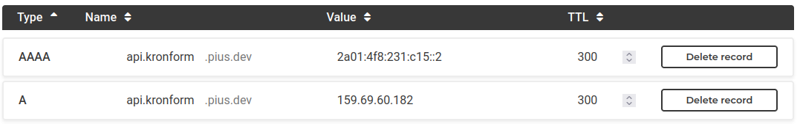
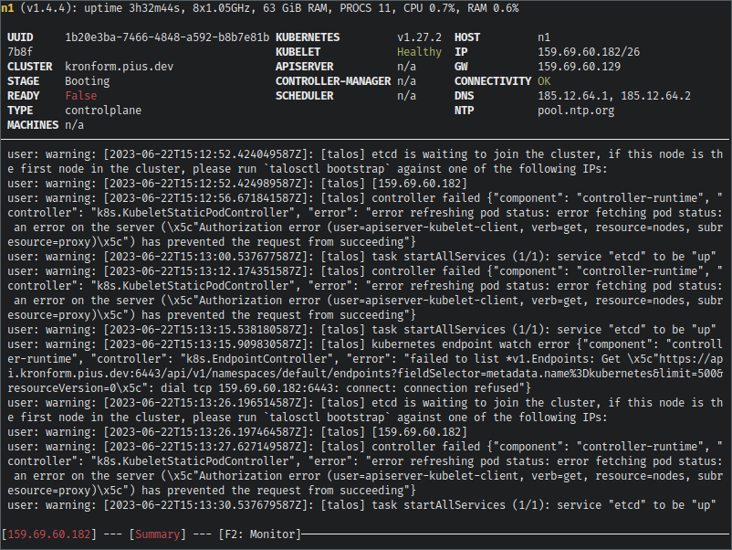
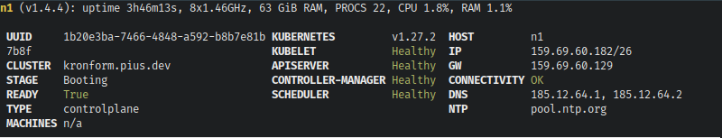

+++
title = "Bare-metal Kubernetes, Part I: Talos on Hetzner"
date = 2023-06-22
draft = false
[taxonomies]
tags = ["kubernetes", "hetzner", "talos"]
+++

I've been running a Kubernetes cluster on a mix of virtual and bare metal machines with Hetzner for about a year now, and while the setup has served me well, being a very exploratory exercise at the time it wasn't very well documented.

To rectify this, and to get a chance to play with some tools I wasn't aware of at the time, I've decided to rebuild the cluster from scratch and document the process through these posts.

I have a rough sketch of the end product on my mind, which I plan to materialize through these steps/posts:

* **[Part I: Talos on Hetzner](@/posts/bare-metal-kubernetes-part-1-talos-on-hetzner/index.md)**
    Covers provisioning of the first server, installation of Talos Linux and configuration and bootstrapping

* **[Part II: Cilium CNI & Firewalls](@/posts/bare-metal-kubernetes-part-2-cilium-and-firewalls/index.md)** Choosing a CNI and implementing network policies and firewall rules without locking ourselves out.

* **[Part III: Encrypted GitOps with FluxCD](@/posts/bare-metal-kubernetes-part-3-encrypted-gitops-with-fluxcd/index.md)** Keeping track of deployed resources with FluxCD, using [SOPS](https://github.com/mozilla/sops) to store encrypt secrets in-repository.

* **Part IV: Ingress, DNS and Certificates** Installing an ingress controller (nginx), DNS controller (externaldns), and certificate manager for automating routing.

* **Part V: Scaling Up** A single node does not a cluster make! Time to scale the cluster up to 3 nodes

* **Part VI: Persistent Storage with Rook Ceph** With 3 nodes and 6 available disks, we're finally eligible to store data long term, which we'll need going forward.

* **Part VII: Private Registry with Harbor** Persistent storage allows us to store and cache the images we use, so let's!

* **Part VIII: Self-hosted Authentication with Kanidm** Using the root/admin credentials everywhere is easy, but not exactly secure. Using an OIDC-capable identity management solution we can hopefully switch most of our services to SSO.

* **Part IX: Monitoring with Prometheus and Grafana** We have a lot of workers and workloads, but very little insight into how they're performing. Let's fix that.

* **Part X: Log collection** Metrics are great for seeing *if* something is wrong, but logs helps to explain *why*.

# Choosing a Kubernetes Distribution

I've deployed Kubernetes clusters in a myriad ways over the years, with all sorts of combinations of k8s|k3s|k0s using kubeadm|[the hard way](https://github.com/kelseyhightower/kubernetes-the-hard-way)|managed(EKS & Exoscale) packaged using both Docker and Hashicorp's Packer and deployed with Ansible or Terraform, or more recently [syself](https://syself.com/)'s [Cluster API Provider for Hetzner](https://github.com/syself/cluster-api-provider-hetzner).

My conclusion at this point is that if you can afford it, both in terms of privacy/GDPR and dollarinos then *managed* is the way to go. If you can't, then you have a bit of investigative work ahead of you.

All of the different tools I've tried have seemed great on paper, but usually had some annoying trade-off or caveat.

For [Packer](https://www.packer.io/) and [Terraform](https://www.terraform.io/) it's state management. Building static virtual machine images for all your control plane and worker nodes sounds great in theory, but you have to put those images *somewhere*. Kubernetes clusters are also not pure idempotent structures, even if they largely aspire to be. Handling cluster bootstrapping, node joining, etc. in Terraform is borderline impossible, not because Terraform is a bad tool, but because it is so far outside the realm of what it's designed to do. Terraform is about desired state, but you can't "desire" your way into bootstrapping a distributed system unless someone has hidden all the nitty gritty details from you behind a managed service.

For Cluster API and its providers, the issue is more of a me-problem than a them-problem. It's a very flexible setup, which is what allows it to work across so many providers and scenarios, even ones that make no effort to provide any kind of official Kubernetes support like Hetzner, or your own desktop Raspberry Pi cluster. All aspects of the cluster itself are managed through Kubernetes and Custom Resource Definitions, which is cool in its own right, but if you dig into the sausage of the Hetzner provider, you'll realize it's a tower built on *bash*. None of this should by any means disqualify it from use, but my experience with it was one of confusion. It did everything it should, but it was at times really hard to follow *why* it was doing what it did, or how. Like I said, I'm really impressed with their work otherwise and Cluster API might be the future, so it's probably a me-problem.

For [k3s](https://k3s.io/), [k0s](https://k0sproject.io/) and all the other minimal Kubernetes distributions the problem is *alignment*. They're able to achieve their streamlined deployment and setup stories by making a lot of difficult decisions for you, which is great as long as your values align with theirs, otherwise you have to compromise, hack or turn back.

Talos Linux of course suffers the same curse as k3s and k0s, taking the decision-making to the extreme and choosing even the kernel for you. Fortunately however, their choices align perfectly with my needs and values. I really like the philosophy of container-oriented distributions and have previously dabbled in [Flatcar Container Linux](https://www.flatcar.org/), but at least at the time I found it very difficult to get working on Hetzner's bare metal servers, although the exact reasons elude me at this time.

Having read through the documentation for Talos Linux, I really like their approach to node and cluster configuration. It's very similar to the way Cluster API approaches it, but by owning the underlynig Linux distribution and not relying on existing tools like kubeadm to interact with the cluster, they get to radically simplify the interface exposed to the administrator, which makes it at least *look* like a very pleasant experience.

Based on that very subjective feeling, my past experience, and of course a healthy dose of grass always being greener, Talos Linux is my choice for this cluster.

# Installing Talos on a Dedicated Server
Their [Quickstart](https://www.talos.dev/v1.4/introduction/quickstart/) and [Getting Started](https://www.talos.dev/v1.4/introduction/getting-started/) guides can get you started with a local Docker-based cluster, or with installing it on one of the supported providers, but deploying it to a Hetzner dedicated server takes some extra steps.

We can't provide the dedicated server with a custom ISO to boot from, but we can boot into Hetzner's rescue system and write the Talos ISO directly to a hard drive which means that next time we reboot the server (providing no other disks have valid boot configurations and take precedence) our server will boot into an unconfigured Talos instance running in Maintenance mode. This was the script I used to install Talos v1.4.4 onto my dedicated server from the Linux rescue system:

```bash
# I'm intentionally picking a version that's behind by patch version so I 
# can try out the upgrade procedure once it's up and running.
TALOS_VERSION="v1.4.4"
# Keep in mind that device paths might change between reboots so either
# double-check the device path, or use one of the udev paths instead.
TARGET_DISK="/dev/sda"

# Download the release asset designed for (bare) metal deployments.
wget -O /tmp/talos.tar.gz https://github.com/siderolabs/talos/releases/download/$TALOS_VERSION/metal-amd64.tar.gz
# Unpack the archive 
tar -xvf /tmp/talos.tar.gz
# Write the raw disk image directly to the hard drive.
dd if=disk.raw of=$TARGET_DISK && sync
shutdown -r now
```

After a while the server should come back up, so let's see if it worked by using the `talosctl` command line utility to interact with the (hopefully up) talos API on the node:

```bash
[mpd@ish]$ talosctl -n 159.69.60.182 disks --insecure
error getting disks: rpc error: code = Unavailable desc = connection error: desc = "transport: Error while dialing: dial tcp 159.69.60.182:50000: i/o timeout"
```
Curious! The server doesn't respond on the Talos API endpoint, looks like something went wrong.

Activating the Hetzner vKVM rescue system and forcing a hardware reset boots the server, and I can see the Talos interface. It even responds to my requests now:

```bash
[mpd@ish]$ talosctl -n 159.69.60.182 disks --insecure
DEV        MODEL            TYPE    MODALIAS      SIZE     BUS_PATH       SYSTEM_DISK
/dev/sda   QEMU HARDDISK    HDD     scsi:t-0x00   2.0 TB   .../0:0:0:0/      
/dev/sdb   QEMU HARDDISK    HDD     scsi:t-0x00   2.0 TB   .../1:0:0:0/      
/dev/sdc   QEMU HARDDISK    HDD     scsi:t-0x00   256 GB   .../2:0:0:0/   *
```
<small>output truncated to fit</small>

I've run into problems magically being solved by Hetzner's [vKVM system](https://docs.hetzner.com/robot/dedicated-server/virtualization/vkvm/) before, so I'm not convinced we're out of the woods yet. If we can boot the system without the vKVM system, I'll put it down to a random fluke and continue configuration.

After another hardware reset (without the rescue system) Talos is still responding to our requests. I'm still not sure of the cause, but let's get on with it[^1].

# Configuring Talos
In order to build a Kubernetes cluster from Talos, you must first configure Talos. This is done in two steps, first by generating a `talosconfig` which similarly to `kubeconfig` contains the definition of a collection of Talos endpoints and credentials to access them with. With Kubernetes you generally configure the cluster first and then extract the kubeconfig, but with Talos, you instead generate the configuration first and then *imprint* it on the individual nodes.

Following along in the [Getting Started](https://www.talos.dev/v1.4/introduction/getting-started/) guide we first have to decide on a cluster name and endpoint. My intention is to run this cluster purely on bare metal, so I don't want to put a load balancer in front of the cluster, although that particular configuration was worked well for me in the past. I want to get as close to a DIY setup as I can, so it can potentially be migrated or extended to on-premise at a later date. For the same reason, and because of the high cost associated with it, using vSwitch and floating IPs is off the table as well.

I've chosen to use DNS load balancing, since I don't expect a lot of churn in control plane/talos nodes, nor heavy load.

## Cluster Name and Endpoint
Let's start by exporting our cluster name and endpoint for future reference. I've picked the clustername "kronform" semi-arbitrarily, and will be using it as a subdomain of one of my existing domains to access it.
```bash
[mpd@ish]$ export CLUSTER_NAME="kronform"
[mpd@ish]$ export API_ENDPOINT="https://api.kronform.pius.dev:6443"
```

## DNS
Create the DNS record pointing to our one node, so it has a chance to propagate by the time we'll need it.



I've configured both IPv4 and IPv6 and set a low time-to-live, so if a node dies and has to be removed from the cluster in the future, its address should get cleared out of most DNS caches relatively quickly.

## Secrets
First we need to generate a secrets bundle which contains all the sensitive keys used to define our cluster:

```bash
[mpd@ish]$ talosctl gen secrets --output-file secrets.yaml
```
We'll need to keep this file safe, but won't be able commit it to git until we have a method of encrypting it.

## talosconfig
Generate the `talosconfig` based on the cluster name and endpoint specified earlier.
```bash
[mpd@ish]$ talosctl gen config  \
    --with-secrets secrets.yaml \
    --output-types talosconfig  \
    --output talosconfig        \
    $CLUSTER_NAME               \
    $API_ENDPOINT
```
I'm not entirely sure why the API endpoint is required at this stage since it doesn't seem to figure in the generated `talosconfig` and the endpoint specified is just `127.0.0.1`. Meanwhile the provided `$CLUSTER_NAME` is used to name the context, so that at least makes sense:

```yaml
context: kronform
contexts:
  kronform:
    endpoints:
    - 127.0.0.1
    ca: LS0t...
    crt: LS0t...
    key: LS0t...
```
Neither the `crt` or `ca` field certificate contain references to this endpoint either, and I suppose they wouldn't since it's for Kubernetes, and this relates to the Talos API.

Like the `secrets.yaml` file, this client configuration is also sensitive.

You can either copy this config file to `~/.talos/config` or use the `talosctl` merge command, which doesn't destroy any existing configurations you might have:
```bash
[mpd@ish]$ talosctl config merge ./talosconfig
```


# Generate our first MachineConfig
Now it's finally time to generate a talos machine configuration for our very first node!

... But not so fast! We'll need to customize it a bit. Now we could use `talosctl` to generate a `controlplane.yaml` generic machine configuration and then modify it to fit our needs, or we could use the patch system as intended instead to generate the finished config directly.

I've created a couple of directories to keep track of all this:

1. `patches/` where I'll put cluster-wide patches,
2. `nodes/` which will contain the per-node patch files, and finally
3. `rendered/` where I'll output the finished machine configurations.

First of all we'll want to enable workloads on our control plane machines. Our servers are quite beefy and since we're going to run only bare metal, we'll need *somewhere* to run the workloads.

```yaml
# patches/allow-controlplane-workloads.yaml
cluster:
  allowSchedulingOnControlPlanes: true
```

Secondly since we'll want to use [Cilium](https://cilium.io/) as our CNI, so we need to disable the default CNI and disable `kube-proxy`, since Cilium comes with its own replacement as per the Talos [documentation](https://www.talos.dev/v1.4/kubernetes-guides/network/deploying-cilium/#machine-config-preparation):

```yaml
# patches/disable-kube-proxy-and-cni.yaml
cluster:
  network:
    cni:
      name: none
  proxy:
    disabled: true
```

We also want to override the cluster name and DNS domain. This is completely optional, but it's nice to have:
```yaml
# patches/cluster-name.yaml
cluster:
  clusterName: kronform.pius.dev
  network:
    dnsDomain: local.kronform.pius.dev
``` 

Finally, we need to add some customizations for our one node (named n1 here):
```yaml
# nodes/n1.yaml
machine:
  install:
    disk: none
    diskSelector:
      size: '< 1TB'
    image: ghcr.io/siderolabs/installer:v1.4.4
  network:
    hostname: n1
    interfaces:
    - interface: eth0
      dhcp: true
```
I'm using the size-based disk selector since both the basic device path `/dev/sda` and the device bus path are subject to change between reboots, which is not ideal since our node is designed to attempt to converge on our desired state, which in some circumstances could cause Talos to reinstall itself multiple times on multiple devices.

I'm also (temporarily) hard-coding the image to use Talos v1.4.4 so we can try out the upgrade procedure once it's up and running. You should omit this line (`image: ghcr...`) from your configuration, if you don't care about that.

With all that done, it's time to generate the actual machine config for our node[^2]:

```bash
[mpd@ish]$ talosctl gen config \
        --output rendered/n1.yaml                                 \
        --output-types controlplane                               \
        --dns-domain local.$CLUSTER_NAME                          \
        --with-cluster-discovery=false                            \
        --with-secrets secrets.yaml                               \
        --config-patch @patches/cluster-name.yaml                 \
        --config-patch @patches/disable-kube-proxy-and-cni.yaml   \
        --config-patch @patches/allow-controlplane-workloads.yaml \
        --config-patch @nodes/n1.yaml                             \
        $CLUSTER_NAME                                             \
        $API_ENDPOINT
```
Configuration can now be found in `nodes/n1.yaml`

# Bootstrap the Cluster
Review the rendered configuration in `rendered/n1.yaml` and apply it!
```bash
[mpd@ish]$ talosctl --nodes 159.69.60.182 apply-config --file rendered/n1.yaml --insecure
```
Rather anticlimactically we get absolutely no response. Luckily, we can use Talos' dashboard functionality to see what's going on:

```bash
[mpd@ish]$ talosctl -n 159.69.60.182 dashboard
rpc error: code = Unavailable desc = connection error: desc = "transport: Error while dialing: dial tcp 127.0.0.1:50000: connect: connection refused"
```
Right. Our `talosconfig` doesn't know about the endpoint, so it just put in 127.0.0.1, let's fix that.

In `~/.talos/config` find the `endpoints` array...

```yaml
# ~/.talos/config (before)
context: kronform
contexts:
    kronform:
        endpoints:
            - 127.0.0.1
# (...)
```
... And replace `127.0.0.1` with our one and only node `159.69.60.182`:
```yaml
# ~/.talos/config (after)
context: kronform
contexts:
    kronform:
        endpoints:
            - 159.69.60.182
# (...)
```
Let's try again!



Sweet! Scrolling back up the logs a bit we can see that the configuration was applied, and the `STAGE` has changed to `Booting`, where it would previously have been `Maintenance`.

More recently in the logs we can see a warning indicating that `etcd` is waiting to join a cluster. This is our cue to initiate the cluster bootstrap, so let's go ahead:

```bash
[mpd@ish]$ talosctl --nodes 159.69.60.182 bootstrap
```

Watching the dashboard logs scroll by, talos will start spewing out a ton of warnings as it starts to reconcile the desired state of the newly bootstrapped cluster, bringing up services.

Eventually it will settle down, and the `READY` state of the node will change to `True`, and all the Kubernetes service indicators will switch to `Healthy`.



Let's reboot the node and see if it the installation stuck, or if we've just been dilly-dallying around in memory.

Since we don't have SSH access to the server, we can either request a hardware reset from the Hetzner Robot interface, or we can just ask Talos to do it for us.

```bash
[mpd@ish]$ talosctl --nodes 159.69.60.182 reboot
```
This will launch a nice dynamic display of the status of the reboot, which is probably useful if you're rebooting multiple nodes.

The node will show as green, go red as it becomes unavailable, switch to yellow as it boots and then finally... Oh.

It never transitions back to green. Interesting. Talos dashboard works, and all the Kubernetes services are up, so let's extract the kubeconfig and see for ourselves.

The following command will create a systems administrator kubeconfig for our new cluster, merge it with our current `~/.kube/config` if one exists, and automatically set our cluster as the currently selected context.
```bash
[mpd@ish]$ talosctl -n 159.69.60.182 kubeconfig
```

```bash
[mpd@ish]$ kubectl get nodes
NAME   STATUS     ROLES           AGE   VERSION
n1     NotReady   control-plane   14m   v1.27.2
```

Our node *exists* so that's good, but it's `NotReady`, why?

```bash
[mpd@ish]$ kubectl describe node n1 | grep NotReady
  Ready            False   Thu, 22 Jun 2023 17:36:18 +0200   Thu, 22 Jun 2023 17:21:32 +0200   KubeletNotReady              container runtime network not ready: NetworkReady=false reason:NetworkPluginNotReady message:Network plugin returns error: cni plugin not initialized
```
Duh. We haven't installed a CNI yet!

We'll consider the job done for now, and tackle CNI-installation in the next post: **[Part II: Cilium CNI & Firewalls](@/posts/bare-metal-kubernetes-part-2-cilium-and-firewalls/index.md)**

# Epilogue
Here I've gathered some of my reflections and learnings from the process.

[^1]: After locking myself out of the cluster while writing [Part II: Cilium CNI & Firewalls](@/posts/bare-metal-kubernetes-part-2-cilium-and-firewalls/index.md) of this series, I encountered the problem again and noticed that the server *was turned off* because I used `shutdown -h` instead of `shutdown -r`. I seem to recall trying to start the server again as part of my troubleshooting the first time around, but I can't be sure of course.

[^2]: Diffing machine configurations
My intuition regarding diffing of machineconfigs was partially correct. When fetching machineconfigs from Talos, they do in fact contain comments, but the returned document is similar to that of a custom resource where the configuration is nested inside `.spec` which means you need to pipe the config through a tool like `yq` to get the document itself, a process which also strips comments. The yaml document generated by `talosctl gen config` uses 4-space indents, wheres the configuration as extract from `talosctl` uses 2-space indents, meaning the original rendered config should be passed through `yq` (like the other is) to ensure identical formatting, otherwise the diff becomes useless. I think the safest way to interact with machineconfigs is a combination of using the built-in tools for common actions like upgrades where images are replaced, and then using `talosctl edit machineconfig` for everything else, making sure to take backups before and after each change.