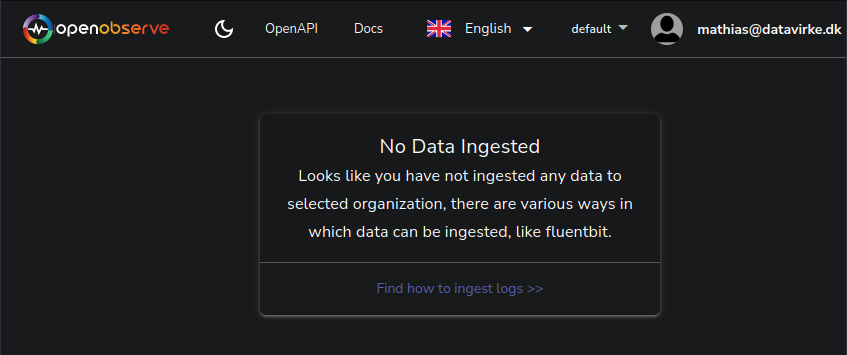
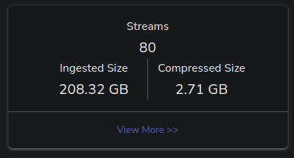
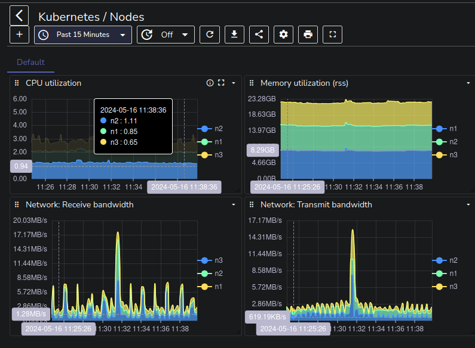

+++
title = "Bare-metal Kubernetes, Part X: Metrics and Monitoring with OpenObserve"
date = 2024-04-24
draft = false
[taxonomies]
tags = ["openobserve", "metrics", "monitoring", "talos", "kubernetes"]
+++

<i>Discussion on <a href="https://news.ycombinator.com/item?id=37443404">Hacker News</a></i>

I intended to write this section much earlier, especially after [the incident](@/posts/bare-metal-kubernetes-first-incident/index.md) where monitoring would have proven very helpful,
but my previous experience configuring my cluster for metrics and log aggregation using a combination of Prometheus, Grafana and Loki was a little lackluster.

At the time Loki was a somewhat new product which might have contributed to my impression, but it felt very sluggish and not very easy to use, so I was reluctant to put a lot of effort into setting it up just to get disappointed again.

My enthusiasm increased a little bit when [OpenObserve](https://openobserve.ai/) recently popped up on my radar. It sells itself as a sort of all-in-one observability platform with a self-hosting option. While the do-one-thing-well and protocol-first approach of products like Prometheus works extremely well for creating an ecosystem of services which can seamlessly integrate it (like Grafana), for something like observability you *really* want an all-encompassing interface which can provide visibility into all aspects of your workloads at once, and not have to switch between Kibana and Grafana to make sense of when exactly your application shit the bed.

So let's give OpenObserve a whirl!

*Series Index*
* [Part I: Talos on Hetzner](@/posts/bare-metal-kubernetes-part-1-talos-on-hetzner/index.md)
* [Part II: Cilium CNI & Firewalls](@/posts/bare-metal-kubernetes-part-2-cilium-and-firewalls/index.md)
* [Part III: Encrypted GitOps with FluxCD](@/posts/bare-metal-kubernetes-part-3-encrypted-gitops-with-fluxcd/index.md)
* [Part IV: Ingress, DNS and Certificates](@/posts/bare-metal-kubernetes-part-4-ingress-dns-certificates/index.md)
* [Part V: Scaling Out](@/posts/bare-metal-kubernetes-part-5-scaling-out/index.md)
* [Part VI: Persistent Storage with Rook Ceph](@/posts/bare-metal-kubernetes-part-6-persistent-storage-with-rook-ceph/index.md)
* [Part VII: Private Registry with Harbor](@/posts/bare-metal-kubernetes-part-7-private-registry-with-harbor/index.md)
* [Part VIII: Containerizing our Work Environment](@/posts/bare-metal-kubernetes-part-8-containerizing-our-work-environment/index.md)
* [Part IX: Renovating old Deployments](@/posts/bare-metal-kubernetes-part-9-renovating-old-deployments/index.md)
* **[Part X: Metrics and Monitoring with OpenObserve](@/posts/bare-metal-kubernetes-part-10-metrics-and-monitoring-with-openobserve/index.md)**

Complete source code for the live cluster is available [@github/MathiasPius/kronform](https://github.com/MathiasPius/kronform)

## (Figuring out how to) Deploy the Platform

Right off the bat, we get the first stick-in-the-spokes of our deployment vehicle: OpenObserve's [Getting Started](https://openobserve.ai/docs/getting-started/) documentation contains a youtube video which acts as more of an introduction to the platform itself, but does provide some help for getting started with their cloud platform. Digging a bit deeper in their docs, the [Quickstart Guide](https://openobserve.ai/docs/quickstart/#self-hosted-installation) has a self-hosted installation section, which immediately shows us how to launch OpenObserve on a Windows platform, but upon further inspection also points to a yaml-file in their repository which contains a `StatefulSet` deployment of the platform. This is indeed a Quick Start, but I was hoping for something a little more refined.

The [High Availability Deployment](https://openobserve.ai/docs/ha_deployment/#helm-charts) section seems to have what we actually want: A helm chart!

We'll be using the [Standalone](https://github.com/openobserve/openobserve-helm-chart/tree/main/charts/openobserve-standalone) deployment since it seems to be configured with the kinds of defaults we need. We don't want external S3 storage (although it might make sense to integrate our [Rook Ceph](@/posts/bare-metal-kubernetes-part-6-persistent-storage-with-rook-ceph/index.md) as an S3-compatible backend in the future) or any of the other cloud features.

Again, the helm chart leaves some things to be desired. The chart doesn't allow you to configure a separate `secretKeyRef` for your [admin credentials](https://github.com/openobserve/openobserve-helm-chart/issues/45), instead forcing you to create secret through the helm chart itself.

This is hazardous for (at least) two reasons:

1. Your secret and not-secret information is now co-mingled in your version control. If we want to update the `HelmRelease` resource in the future (or have Renovate do it), we need to decrypt, modify, and then re-encrypt the file. This process is error prone, and the consequence is credential leakage!

2. The `HelmRelease` resource which users may well want access to contains the plaintext non-obfuscated `values` declaration for the deployed resource, meaning they can now read the root username and password!

Luckily the helm chart does provide an override of sorts in the form of `extraEnv`, and with that our final `values` section of the HelmRelease looks like this:

```yaml
# manifests/infrastructure/openobserve/openobserve.yaml
config:
  ZO_TELEMETRY: "false"
  ZO_TELEMETRY_URL: "http://127.0.0.1"
  ZO_WEB_URL: "https://obs.kronform.pius.dev"
persistence:
  size: 50Gi
ingress:
  enabled: true
  annotations:
    cert-manager.io/issuer: ""
    cert-manager.io/cluster-issuer: letsencrypt-production
    nginx.ingress.kubernetes.io/enable-cors: "true"
  hosts:
    - host: obs.kronform.pius.dev
      paths:
        - path: /
          pathType: ImplementationSpecific
  tls:
    - secretName: obs.kronform.pius.dev-tls
      hosts:
        - obs.kronform.pius.dev
extraEnv:
  - name: ZO_ROOT_USER_EMAIL
    valueFrom:
      secretKeyRef:
        name: openobserve-credentials
        key: ZO_ROOT_USER_EMAIL
  - name: ZO_ROOT_USER_PASSWORD
    valueFrom:
      secretKeyRef:
        name: openobserve-credentials
        key: ZO_ROOT_USER_PASSWORD
```

Apart from the security stuff, I've also disabled telemetry (really, this needs to be opt-in), granted it a little more local storage, and configured ingress using our previously configured cert-manager cluster issuer `letsencrypt-production`.

That last part actually [did not work](https://github.com/openobserve/openobserve-helm-chart/issues/60). The default `values.yaml` definition for the chart explicitly sets `cert-manager.io/issuer: letsencrypt`, but since we're using a *cluster* issuer, adding our annotation as above breaks the ingress definitions since it now contains the merged values with both the `cert-manager.io/issuer` and `cert-manager.io/cluster-issuer` annotations, meaning cert-manager doesn't know which to use and defaults to the safe choice of using neither.

I initially got around this by simply editing the ingress directly and removing the `cert-manager.io/issuer` annotation, which allowed cert-manager to proceed with the certificate issuing process. Another fix would be to simply use the built-in namespaced issuer configured in the chart. After sleeping on the problem and googling a bit, it dawned on me that you can actually *remove* default values using `null` as the value, so the real fix was as easy as:

```yaml
# manifests/infrastructure/openobserve/openobserve.yaml
annotations:
  cert-manager.io/issuer: null
```

With all those headaches out of the way, we finally have OpenObserve up and running!



## A Significant Detour

Now that the OpenObserve platform appears to be up and running, it's time to set up the [OpenTelemetry](https://opentelemetry.io/docs/what-is-opentelemetry/) operators, which gives us a Kubernetes-native and very flexible way of gathering metrics and logs from our cluster.

 Deployment is as easy as `kubect apply`ing [this](https://github.com/open-telemetry/opentelemetry-operator/releases/download/v0.100.0/opentelemetry-operator.yaml) manifest, or in our case pointing a Kustomization at it instead:

 ```yaml
# manifests/infrastructure/openobserve/kustomization.yaml
---
apiVersion: kustomize.config.k8s.io/v1beta1
kind: Kustomization
resources:
  - namespace.yaml
  - secret.yaml
  - openobserve.yaml
  - https://github.com/open-telemetry/opentelemetry-operator/releases/download/v0.100.0/opentelemetry-operator.yaml
 ```

The next obvious step is to deploy the [openobserve-collector](https://github.com/openobserve/openobserve-helm-chart/tree/main/charts/openobserve-collector) which claims to be an opinionated [`OpentelemetryCollector`](https://opentelemetry.io/docs/collector/), but this is where things kind of got out of hand.

The openobserve-collector spawns a `DaemonSet` of agents which are responsible for collecting metrics and logs from each of the Kubernetes nodes in our cluster, and neither of these worked as expected out of the gate.

### Kubelet Metrics

Openobserve's Collector runs as a pod on each node, speaking directly to the Kubelet on port `10250/tcp`. The way it goes about doing this, is by getting the `spec.nodeName` from its own pod using [fieldRef](https://kubernetes.io/docs/tasks/inject-data-application/environment-variable-expose-pod-information/), and then relying on DNS resolution to turn this node name into an IP address. Unfortunately, this node name does *not* resolve to an IP address, at least not on Talos 1.6.4 which I was running at the time, but by some chance this feature just happened to added in [1.7.0](https://www.talos.dev/v1.7/talos-guides/network/host-dns/#resolving-talos-cluster-member-names).

After upgrading to 1.7.0 and enabling both `resolveMembers` and `kubeDNSForwardToHost`, thereby having the in-cluster coredns deployment forward queries it can't answer to the talos host DNS service which *can* resolve node names, it still doesn't work and what's more loads of other things are experiencing problems too! Upon inspecting the coredns deployment, its logs were full of I/O Timeouts:

```
[ERROR] plugin/errors: 2 n1. AAAA: read udp 10.244.2.224:44731->10.96.0.9:53: i/o timeout
[INFO] 127.0.0.1:52536 - 21131 "HINFO IN 1257736523734931135.7903262571643399098. udp 57 false 512" - - 0 2.000614444s
[ERROR] plugin/errors: 2 1257736523734931135.7903262571643399098. HINFO: read udp 10.244.2.224:60119->10.96.0.9:53: i/o timeout
[INFO] 10.244.0.177:49041 - 60274 "A IN n1. udp 31 false 1232" - - 0 2.001034212s
[ERROR] plugin/errors: 2 n1. A: read udp 10.244.2.224:37690->10.96.0.9:53: i/o timeout
[INFO] 10.244.0.177:59943 - 33782 "AAAA IN n1. udp 31 false 1232" - - 0 2.001026451s
[ERROR] plugin/errors: 2 n1. AAAA: read udp 10.244.2.224:60033->10.96.0.9:53: i/o timeout
```

Asking around in the Talos community [Matthew Duncan](https://mahdtech.com/) pointed me to an issue in the Talos repository showing a nearly [identical issue](https://github.com/siderolabs/talos/issues/8661) which was supposedly resolved in Talos 1.7.1. Unfortunately after upgrading all the nodes once again, the problem persisted. Looking through the Talos issues, another one caught my eye: [1.7.1 with hostdns and forwardKubeDNSToHost doesn't resolve anything](https://github.com/siderolabs/talos/issues/8698). The conditions and outcome matched mine, and after providing my own discoveries, someone suggested it might be caused by IPv4 masquerading performed by Cilium. This seemed a very reasonable suggestion, since I could see in the Hubble UI that UDP packets were going out to the host, but the return packets to the CoreDNS service were dropped!

Messing around with the masquerading options in Cilium, I tried a number of different combinations:

1. Iptables masquerade enabled for IPv4.
2. Masquerading disabled entirely.
3. bpf masquerading enabled for IPv4.

Unfortunately none of these worked out, and I had spent roughly 10 hours attempting to get this to work at this point, so I decided to take a few steps back..

Going back to the original issue which was Openobserve Collector attempting to call out to:

> `https://{{ spec.nodeName }}:10250`

I realized that I could of course just use the IP address instead! All I needed to do was replace the target with (effectively):

>  `https://{{ status.nodeIp }}:10250`

True to form however, the OpenObserve Helm chart provided no way of doing so, so I was forced extract the otherwise quite well designed [OpenTelemetryCollector](https://github.com/MathiasPius/kronform/blob/main/manifests/infrastructure/openobserve/agent-collector.yaml) manifests which the helm chart would generate and deploy them manually, allowing me to override the necessary fields.

The change was rather simple. By injecting the node IP into the Pod's environment:

```yaml
# manifests/infrastructure/openobserve/agent-collector.yaml
env:
  - name: K8S_NODE_IP
    valueFrom:
      fieldRef:
        fieldPath: status.hostIP
```

I could modify the endpoint value for the `kubeletstat` receiver:

```yaml
# manifests/infrastructure/openobserve/agent-collector.yaml
kubeletstats:
  endpoint: https://${env:K8S_NODE_IP}:10250
```

And now we're getting metrics!



### Pod Logs

Next up on the list of things not working out of the box is log collection. OpenTelemetryCollector is configured to mount the `/var/log` directory of the host it is running on and continuously hoover up log data from pods running on the server.

Unfortunately, it just so happens that for some reason the `filelog` receiver module of the OpenTelemetry Collector is hitting some kind of `permission denied` error when attempting to traverse the `/var/log/pods` directory.

```
2024-05-15T12:40:06.200Z        warn    fileconsumer/file.go:43 finding files: no files match the configured criteria
find files with '/var/log/pods/*/*/*.log' pattern: open .: permission denied    {"kind": "receiver", "name": "filelog/std", "data_type": "logs", "component": "fileconsumer"}
```

I reached out (again) in the Sidero Labs' slack support channel for some help in narrowing down whether this was a Talos-ism causing the problems, or if the filelog receiver was doing something dodgy, and [@frezbo](https://github.com/frezbo) helpfully pointed out that in the [official Loki audit logging example](https://www.talos.dev/v1.7/learn-more/knowledge-base/#logging-kubernetes-audit-logs-with-loki), the `CAP_DAC_READ_SEARCH` capability is added to the container, which *could* also be necessary for the filelog receiver.

Modifying the helm chart as follows, sprinkling in some `CAP_SYS_ADMIN` and `privileged: true` just for good measure...

```yaml
# manifests/infrastructure/openobserve/agent-collector.yaml
securityContext:
    privileged: true
    capabilities:
      add:
        - DAC_READ_SEARCH
        - SYS_ADMIN
```

.. Yielded the same exact result.

Slightly frustrated with the experience and now easily 20 hours into this process, I filed a [bug report](https://github.com/open-telemetry/opentelemetry-collector-contrib/issues/33083) and simply outsourced the log collection part to fluent-bit, which has a [documented example](https://www.talos.dev/v1.7/talos-guides/configuration/logging/#fluent-bit-example) on the Talos documentation website, easy peasy!

Now we just configure a processor for the logs in the OpenTelemetry Collector:

```yaml
# manifests/infrastructure/openobserve/gateway-collector.yaml
config:
  processors:
    batch:
  receivers:
    otlp/logs:
      protocols:
        http:
          endpoint: 0.0.0.0:4418
  service:
    pipelines:
      logs/fluentbit-forward:
        exporters:
          - otlphttp/openobserve
        processors:
          - batch
        receivers:
          - otlp/logs
```

And add the `[OUTPUT]` section to forward the data to our gateway collector:

```yaml
# manifests/infrastructure/openobserve/fluentbit.yaml
outputs: |
  [OUTPUT]
    Name                 opentelemetry
    Match                *
    Host                 openobserve-collector-gateway-collector
    Port                 4418
    Log_response_payload True
    Tls                  Off
    logs_body_key $message
    logs_span_id_message_key span_id
    logs_trace_id_message_key trace_id
    logs_severity_text_message_key loglevel
    logs_severity_number_message_key lognum
```

Of course nothing about this is that easy. For some unknown reason, the fluent-bit daemonset continuously failed liveness and readiness probes for reasons I have not had time to investigate, this despite the fact that the pods are actually doing exactly what they're supposed to. Logs are getting picked up and sent on to the OpenTelemetry Collector, and then forwarded to the OpenObserve platform as intended.s

For now I've resolved this using the power of `null`, picked up in the cert-manager ingress section:

```yaml
# manifests/infrastructure/openobserve/fluentbit.yaml
livenessProbe: null
readinessProbe: null
```

## Making use of the Data

With all this setup finally done, my plan was to design some dashboards to monitor the things I actually cared about, but at this point I was just happy to finally be done with it, and to have some historical data to look at in case the cluster ever acts up again, so I decided to take the easy route and just import some of the [OpenObserve Dashboards](https://github.com/openobserve/dashboards) and customizing them to my liking.



There are still a bunch of tasks left, like configuring the Talos nodes to forward their internal logs to the Fluent-bit forwarder for example, but I think I'll leave that for the next post where I might also setup some alerting for some of the critical services running in the cluster, like my friends' TeamSpeak server, once I've familiarized myself a bit with the OpenObserve platform.

## Conclusion

In conclusion, I think OpenObserve is a very interesting platform, and it definitely feels snappy and looks very good. With that said, it's pretty obvious that the platform is new, and (rationally) focusing heavily on their paid/cloud platform which unfortunately leaves the self-hosted option with quite a few gaps as far as deployment process, documentation and standardization goes.

All in all, it's *promising* and hopefully some of the gotchas experienced above will be ironed out in time.
