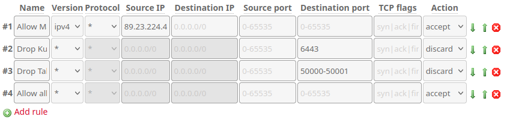
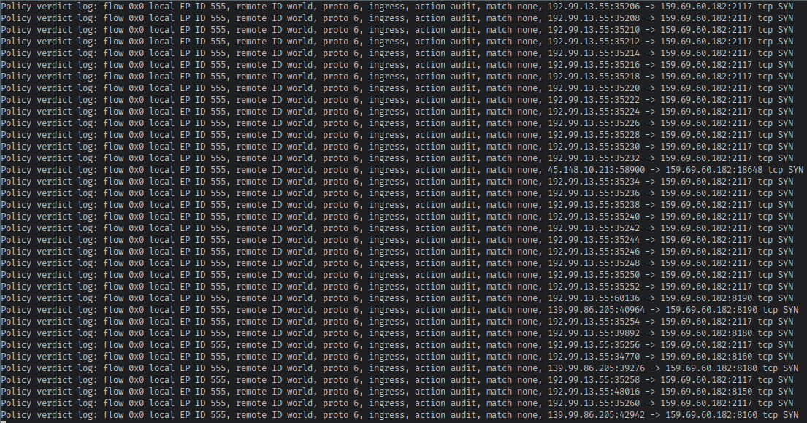

+++
title = "Bare-metal Kubernetes, Part II: Cilium CNI & Firewalls"
date = 2023-06-23
draft = false
[taxonomies]
tags = ["kubernetes", "hetzner", "talos", "cilium"]
+++

Ah, that new cluster smell!

We've got a brand new cluster exposed directly to the internet, and it doesn't even work yet. Let's get to work remedying that.

*Series Index*
* [Part I: Talos on Hetzner](@/posts/bare-metal-kubernetes-part-1-talos-on-hetzner/index.md)
* **[Part II: Cilium CNI & Firewalls](@/posts/bare-metal-kubernetes-part-2-cilium-and-firewalls/index.md)**
* [Part III: Encrypted GitOps with FluxCD](@/posts/bare-metal-kubernetes-part-3-encrypted-gitops-with-fluxcd/index.md)
* Part IV: Ingress, DNS and Certificates
* Part V: Scaling Up
* Part VI: Persistent Storage with Rook Ceph
* Part VII: Private Registry with Harbor
* Part VIII: Self-hosted Authentication with Kanidm
* Part IX: Monitoring with Prometheus and Grafana
* Part X: Log collection

# Picking a CNI
Talos Linux defaults to using [flannel](https://ubuntu.com/kubernetes/docs/cni-flannel), and both it and [calico](https://docs.tigera.io/calico/latest/about/) (which are the two other CNIs I have experience with) are perfectly adequate CNIs.

The last few clusters I've built have used Cilium, and I've come to really like it. It's extremely performant and has a lot of great features out of the box:

* Optional wireguard-based inter-node communication.
* Network Policies that you can [attach to nodes](https://docs.cilium.io/en/latest/network/kubernetes/policy/#ciliumclusterwidenetworkpolicy) (CRD-based node firewalling!)
* [Hubble](https://docs.cilium.io/en/latest/network/kubernetes/policy/#ciliumclusterwidenetworkpolicy), super intuitive visualization of traffic within your cluster/namespaces.

# Installing Cilium
Compared to bootstrapping a node, this is a breeze. Just install the helm chart!

First we need to add the Helm repository locally.
```bash
[mpd@ish]$ helm repo add cilium https://helm.cilium.io/
```
Then define some variables.
```bash
[mpd@ish]$ export KUBERNETES_API_SERVER_ADDRESS=api.kronform.pius.dev
[mpd@ish]$ export KUBERNETES_API_SERVER_PORT=6443
[mpd@ish]$ export CLUSTER_DOMAIN=local.kronform.pius.dev
```
And then install:
```bash
[mpd@ish]$ helm install                                         \
    cilium                                                      \
    cilium/cilium                                               \
    --version 1.13.4                                            \
    --namespace kube-system                                     \
    --set ipam.mode=kubernetes                                  \
    --set hostFirewall.enabled=true                             \
    --set hubble.relay.enabled=true                             \
    --set hubble.ui.enabled=true                                \
    --set hubble.peerService.clusterDomain=${CLUSTER_DOMAIN}    \
    --set etcd.clusterDomain=${CLUSTER_DOMAIN}                  \
    --set kubeProxyReplacement=strict                           \
    --set securityContext.capabilities.ciliumAgent="{CHOWN,KILL,NET_ADMIN,NET_RAW,IPC_LOCK,SYS_ADMIN,SYS_RESOURCE,DAC_OVERRIDE,FOWNER,SETGID,SETUID}" \
    --set securityContext.capabilities.cleanCiliumState="{NET_ADMIN,SYS_ADMIN,SYS_RESOURCE}" \
    --set cgroup.autoMount.enabled=false                        \
    --set cgroup.hostRoot=/sys/fs/cgroup                        \
    --set k8sServiceHost="${KUBERNETES_API_SERVER_ADDRESS}"     \
    --set k8sServicePort="${KUBERNETES_API_SERVER_PORT}"
```
<small>In Part III I'll translate this into a FluxCD `HelmChart` so we can manage it in git and keep it updated.</small>

Most of options above are taken directly from [Talos' own Cilium deployment guide](https://www.talos.dev/v1.4/kubernetes-guides/network/deploying-cilium/), and provide a better explanation than I could. The options I've set are:

* `--set hubble.peerService.clusterDomain=${CLUSTER_DOMAIN}` because I changed the cluster domain.
* `--set etcd.clusterDomain=${CLUSTER_DOMAIN}` same as above.
* `--set hubble.relay.enabled=true` because Hubble is great for debugging network policy errors.
* `--set hubble.relay.enabled=true` same as above.
* `--set hostFirewall.enabled=true` so we can use `CiliumClusterWideNetworkPolicy` for firewalling.


Following along in the Talos Dashboard, we can see Cilium is doing work, and very soon after our node enters the `Ready` state:

```bash
[mpd@ish]$ kubectl get nodes                                         
NAME   STATUS   ROLES           AGE     VERSION
n1     Ready    control-plane   4h37m   v1.27.2
```
We have connectivity! The cluster is now operational, but it's still completely open to the internet.

# Firewalling
Cilium comes with a custom network policy resource which unlike regular Kubernetes [Network Policies](https://kubernetes.io/docs/concepts/services-networking/network-policies/) can be deployed across the entire cluster, instead of just within a namespace. This enables them to apply to cluster-wide resources like for example *nodes*.

With some cleverly defined *CiliumClusterWideNetworkPolicies* targeted at our cluster nodes, we can define - using the familiar Kubernetes interface - firewall rules to protect our nodes from the outside world.

## Doors Ajar
There's one little catch(-22) though. Since our firewall rules are defined in-cluster, it means if we lock ourselves out, we won't have any way of getting back in to fix the problem which locked us out in the first place. I'd like to add an IP whitelist to the Kubernetes and Talos API endpoints, but since my IP address is subject to change, I don't want to risk locking myself out and waiting for the DHCP gods to let me back in.

By using `CiliumClusterWideNetworkPolicy` for *most* things, but leaving some Hetzner Robot configured escape hatches in, we can spare ourselves a complete cluster rebuild in the future, if catastrophy strikes.

This means that we'll have to configure these specific rules in the [Hetzner Robot Firewall](https://docs.hetzner.com/robot/dedicated-server/firewall/) interface. I'm creating a Firewall Template with the rules, so we can just re-apply it when we add more nodes to the cluster later on. The template looks like this:



By defining the rules in this way, with an explicit *allow* for myself, then explicit *discard* for accessing Talos and Kube API Server, followed by explicit *allow* I succeeded in limiting access to those API endpoints to only me:
1. If the source address is my home, immediately accept the packet, ending evaluation.
2. If rule 1 did not apply AND the destination port is Kube API Server (`6443`), discard the packet.
3. If rule 1 & 2 did not apply AND the destination port is in the Talos range (`50000-500001`), discard the packet.
4. If none of the above rules applied, allow the packet through.

This is a very permissive firewall, but keep in mind that we'll be managing most of our firewalling with Cilium.

Speaking of escape hatches, let's talk about Cilium's PolicyAuditMode.

## Policy Audit Mode
Applying network policies to nodes it's entirely possible that I end up breaking Talos' ability to communicate with the cluster, or break cluster access in some other funky ways. For this reason it's a good idea to put our node into [Audit Mode](https://docs.cilium.io/en/v1.13/security/host-firewall/#enable-policy-audit-mode-for-the-host-endpoint) which means that policy violations (dropped packets) won't actually be dropped, they'll just report the violation.

This means that we can inspect the audit log and see if our policies are working, without the risk of losing access to the node.

Enabling audit mode is a little involved since Cilium operates on its own internal representation of the cluster via identities and endpoints, so first we need to figure out what our node's endpoint is. We could install the cilium cli locally and use that to interact with our setup, but it's much easier to just the cilium pod already deployed inside our cluster, so let's find it.

```bash
[mpd@ish]$ kubectl -n kube-system get pods -l "k8s-app=cilium"
NAME           READY   STATUS    RESTARTS   AGE
cilium-gtxsf   1/1     Running   0          12h
```
In Cilium identities are just 16-bit integers assigned by Cilium, with the lower range reserved for *special* identities which cover things like *hosts* (1), *world* (2), *kube-apiserver* (7), which lets you easily write policies which target one of these.

Identity `1` is the one reserved for hosts, which is what we want to put into audit mode. We can't put an identity into audit mode though, so first we need to find the endpoint matching the *host* identity:

```
[mpd@ish]$ kubectl exec -n kube-system cilium-gtxsf \
  -- cilium endpoint list -o jsonpath='{[?(@.status.identity.id==1)].id}'
555
```
I suggest running the command without the jsonpath filter just to get a feel for what the output looks like, I only used the jsonpath filter because the output is a bit too large and confusing to fit on this page.

Anyway, we have our endpoint now: `555`. Let's check the configuration of our host endpoint first:
```bash
[mpd@ish]$ kubectl exec -n kube-system cilium-gtxsf \
  -- cilium endpoint config 555
ConntrackAccounting               : Enabled
ConntrackLocal                    : Disabled
Debug                             : Disabled
DebugLB                           : Disabled
DebugPolicy                       : Disabled
DropNotification                  : Enabled
MonitorAggregationLevel           : Medium
PolicyAuditMode                   : Disabled # <-- this one
PolicyVerdictNotification         : Enabled
TraceNotification                 : Enabled
```
It's disabled as expected, so let's enable it:
```bash
[mpd@ish]$ kubectl exec -n kube-system cilium-gtxsf \
  -- cilium endpoint config 555 PolicyAuditMode=Enabled
Endpoint 555 configuration updated successfully
```

And checking the config again:
```bash
kubectl exec -n kube-system cilium-gtxsf \
  -- cilium endpoint config 555 | grep PolicyAuditMode
PolicyAuditMode                   : Enabled
```
Great!

Since we haven't actually applied our network policy yet, there won't be any policies to audit.

Cilium uses an enforcement mode to decide how traffic is controlled. The default enforcement mode means that endpoints which don't have any policies associated with them default to allow, which means that unless we actually have applied a policy, Cilium won't care. Of course you can put Cilium into strict enforcement mode, and we might at a later point, but without any policies assigned, we'd literally break everything by doing so.

## Building Up
Since we've enabled audit mode, we can go ham applying the dumbest most restrictive possible policy without worry. Let's write a small policy for allowing traffic from anywhere to Talos's and Kubernetes' APIs, since we block those in the Hetzner firewall anyway.

```yaml
# policies/host-fw-control-plane.yaml
apiVersion: "cilium.io/v2"
kind: CiliumClusterwideNetworkPolicy
metadata:
  name: "host-fw-control-plane"
spec:
  description: "control-plane specific access rules."
  nodeSelector:
    matchLabels:
      node-role.kubernetes.io/control-plane: ""
  ingress:
  # Allow access to kube api from anywhere.
  - fromEntities:
    - world
    - cluster
    toPorts:
    - ports:
      - port: "6443"
        protocol: "TCP"

  # Allow access to talos from anywhere.
  # https://www.talos.dev/v1.4/learn-more/talos-network-connectivity/
  - fromEntities:
    - world
    - cluster
    toPorts:
    - ports:
      - port: "50000"
        protocol: "TCP"
      - port: "50001"
        protocol: "TCP"
```

Applying the above:
```bash
[mpd@ish]$ kubectl apply -f policies/host-fw-control-plane.yaml
```
We still have access! Let's take a look at the audit log and see how our policy is fairing using `cilium monitor` and limiting the output to traffic coming to or from our node endpoint `555`:

```bash
[mpd@ish]$ kubectl exec -n kube-system cilium-gtxsf -- cilium monitor -t policy-verdict --related-to 555
```



Welcome to the internet! Your ports *will* be scanned!


The only things I really care about at this stage however, is if our policy allows us to interact with Kubernetes and Talos, so let's try those

```bash
[mpd@ish]$ kubectl get pods
[mpd@ish]$ talosctl -n 159.69.60.182 time
```

Following along in the monitor log we can see `action allow` for those entries:
``` 
Policy verdict log: flow 0x0 local EP ID 555, remote ID world, proto 6, ingress, action allow, match L3-L4, 89.23.224.44:56372 -> 159.69.60.182:6443 tcp SYN

Policy verdict log: flow 0x0 local EP ID 555, remote ID world, proto 6, ingress, action allow, match L3-L4, 89.23.224.44:58916 -> 159.69.60.182:50000 tcp SYN
```
Awesome!

`cilium monitor` is a great tool for debugging connectivity issues and designing policies. Starting out with a very restrictive policy and just adding rules is a simple but sometimes time-consuming way of building robust policies. The policy below is one I've come up with based on documentation of Kubernetes workings and some trial and error:

```yaml
# policies/host-fw-control-plane.yaml
apiVersion: "cilium.io/v2"
kind: CiliumClusterwideNetworkPolicy
metadata:
  name: "host-fw-control-plane"
spec:
  description: "control-plane specific access rules."
  nodeSelector:
    matchLabels:
      node-role.kubernetes.io/control-plane: ""
  ingress:
  # Allow access to kube api from anywhere.
  - fromEntities:
    - world
    - cluster
    toPorts:
    - ports:
      - port: "6443"
        protocol: "TCP"

  # Allow access to talos from anywhere.
  # https://www.talos.dev/v1.4/learn-more/talos-network-connectivity/
  - fromEntities:
    - world
    - cluster
    toPorts:
    - ports:
      - port: "50000"
        protocol: "TCP"
      - port: "50001"
        protocol: "TCP"

  # Allow kube-proxy-replacement from kube-apiserver
  - fromEntities:
    - kube-apiserver
    toPorts:
    - ports:
      - port: "10250"
        protocol: "TCP"
      - port: "4244"
        protocol: "TCP"

  # Allow access from hubble-relay to hubble-peer (running on the node)
  - fromEndpoints:
    - matchLabels:
        k8s-app: hubble-relay
    toPorts:
    - ports:
      - port: "4244"
        protocol: "TCP"

   # Allow metrics-server to scrape
  - fromEndpoints:
    - matchLabels:
        k8s-app: metrics-server
    toPorts:
    - ports:
      - port: "10250"
        protocol: "TCP"

  # Allow ICMP Ping from/to anywhere.
  - icmps:
    - fields:
      - type: 8
        family: IPv4
      - type: 128
        family: IPv6

  # Allow cilium tunnel/health checks from other nodes.
  - fromEntities:
    - remote-node
    toPorts:
    - ports:
      - port: "8472"
        protocol: "UDP"
      - port: "4240"
        protocol: "TCP"

  # Allow access to etcd and api from other nodes.
  - fromEntities:
    - remote-node
    toPorts:
    - ports:
      - port: "2379"
        protocol: "TCP"
      - port: "2380"
        protocol: "TCP"
      - port: "51871"
        protocol: "UDP"

```

# Final Exam
Relatively confident in our ability to not lock ourselves out, it's time to leave Policy Audit Mode and test our skills for real.

```bash
[mpd@ish]$ kubectl exec -n kube-system cilium-gtxsf \
  -- cilium endpoint config 555 PolicyAuditMode=Disabled
Endpoint 555 configuration updated successfully
```
Running our Talos and Kubectl tests from before again proves we still have access. Meanwhile all the `action audit` entries in our cilium monitor output have turned into `audit deny`, which means traffic is actually getting dropped.

In [Part III: Encrypted GitOps with FluxCD](@/posts/bare-metal-kubernetes-part-3-encrypted-gitops-with-fluxcd/index.md), we'll setup FluxCD and try to get as much of our code (machineconfigs, helm releases, network policies, etc.) shoved into Git so we can be all ***~GitOpsy~***
