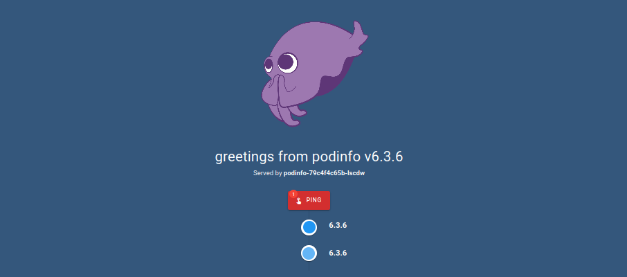

+++
title = "Bare-metal Kubernetes, Part III: Encrypted GitOps with FluxCD"
date = 2023-06-24
draft = false
[taxonomies]
tags = ["kubernetes", "fluxcd", "sops", "gitops"]
+++

We've got an actually working cluster now that is relatively secure, but rebuilding it and keeping it up to date is going to be a real chore.

Storing things like machine configurations, Talos config files and network policies in a git repository would help with the rebuilding part, but not with keeping it up to date. For that, we'll need some kind of continuous deployment system like [ArgoCD](https://argo-cd.readthedocs.io/en/stable/) or [FluxCD](https://fluxcd.io/).

*Series Index*
* [Part I: Talos on Hetzner](@/posts/bare-metal-kubernetes-part-1-talos-on-hetzner/index.md)
* [Part II: Cilium CNI & Firewalls](@/posts/bare-metal-kubernetes-part-2-cilium-and-firewalls/index.md)
* **[Part III: Encrypted GitOps with FluxCD](@/posts/bare-metal-kubernetes-part-3-encrypted-gitops-with-fluxcd/index.md)**
* [Part IV: Ingress, DNS and Certificates](@/posts/bare-metal-kubernetes-part-4-ingress-dns-certificates/index.md)
* [Part V: Scaling Out](@/posts/bare-metal-kubernetes-part-5-scaling-out/index.md)
* Part VI: Persistent Storage with Rook Ceph
* Part VII: Private Registry with Harbor
* Part VIII: Self-hosted Authentication with Kanidm
* Part IX: Monitoring with Prometheus and Grafana
* Part X: Log collection

Complete source code for the live cluster is available at: https://github.com/MathiasPius/kronform

# Choosing FluxCD
I've previously used ArgoCD for keeping helm releases up to date within a cluster, but they didn't support specifying helm values files in a separate directory from the chart, which effectively meant that if you needed to change *even a single value* of a chart, you had to basically create a new chart which had the original as a sub-chart and set the values that way.[^1]

FluxCD seems to solve this by having the helm values as part of the `spec` of their [`HelmRelease`](https://fluxcd.io/flux/components/helm/helmreleases/) resource, while also enabling some pretty cool integrations like [release promotion](https://fluxcd.io/flux/use-cases/gh-actions-helm-promotion/) out of the box.

Let's see how it fares compared to my experience with ArgoCD.

# Installing FluxCD
The [Get Started with Flux](https://fluxcd.io/flux/get-started/) guide starts by declaring that you'll need GitHub credentials before continuing, but this is only because the guide targets GitHub, which is probably reasonable. Flux seems to work natively with the biggest [git servers](https://fluxcd.io/flux/components/notification/provider/), which is nice to know since we *might* want to move to a self-hosted forgejo|gitea|gitlab instance at some point.


## Repository and Personal Access Token
I went ahead and created a repository [@github/MathiasPius/kronform](https://github.com/MathiasPius/kronform), and embarked to configure a personal access token, as the guide requires. 

Unfortunately the documentation is really vague about which permissions are necessary, and as far as I can tell it isn't explicitly mentioned anywhere. Not being entirely sure how Flux works internally, I went ahead and created a PAT with Read/Write access to most of the functionality on *just* the one repository:

Read access to `kronform`: 
* metadata

Read *and* Write access to `kronform`:
* Dependabot alerts
* actions
* actions variables
* administration
* code
* commit statuses
* dependabot secrets
* deployments
* discussions
* environments
* issues
* merge queues
* pull requests
* repository advisories
* repository hooks
* secret scanning alerts
* secrets
* security events
* workflows 

## Bootstrapping
The easiest, and apparently only, way of installing FluxCD is through the `flux` cli, so I installed it through my package manager. The latest available version was `2.0.0-rc.5`

Again, following the official guide I exported my credentials:
```bash
[mpd@ish]$ export GITHUB_USER=MathiasPius
[mpd@ish]$ export GITHUB_TOKEN=github_pat_...
```

And ran the bootstrap command:
```bash
[mpd@ish]$ flux bootstrap github \
  --owner=$GITHUB_USER           \
  --repository=kronform          \
  --branch=main                  \
  --path=./manifests             \
  --personal
```
Everything went along swimmingly, until it seemed to hang while waiting for some Kustomizations to reconcile:
```bash
► connecting to github.com
► cloning branch "main" from Git repository "https://github.com/MathiasPius/kronform.git"
✔ cloned repository
► generating component manifests
# (...)
✔ committed sync manifests to "main" ("be94c9fb726fcab7eb0aff77a0668be41f6f4429")
► pushing sync manifests to "https://github.com/MathiasPius/kronform.git"
► applying sync manifests
✔ reconciled sync configuration
◎ waiting for Kustomization "flux-system/flux-system" to be reconciled
# Process hangs here, and then fails below.
✗ client rate limiter Wait returned an error: context deadline exceeded
► confirming components are healthy
✔ helm-controller: deployment ready
✔ kustomize-controller: deployment ready
✔ notification-controller: deployment ready
✔ source-controller: deployment ready
✔ all components are healthy
✗ bootstrap failed with 1 health check failure(s)
```
Googling around I found some other people encountering the same issue, but the cause seemed to be specific to OpenShift.

Using the `flux` cli to list the kustomizations explained exactly what went wrong though:

```bash
[mpd@ish]$ flux get kustomizations
NAME            REVISION        SUSPENDED       READY   MESSAGE
flux-system                     False           False   failed to download archive: GET http://source-controller.flux-system.svc.cluster.local./gitrepository/flux-system/flux-system/be94c9fb.tar.gz giving up after 10 attempt(s): Get "http://source-controller.flux-system.svc.cluster.local./gitrepository/flux-system/flux-system/be94c9fb.tar.gz": dial tcp: lookup source-controller.flux-system.svc.cluster.local. on 10.96.0.10:53: no such host
```
`.cluster.local`. That explains it. Flux assumes the dns domain of the cluster is `cluster.local` and requires us to override it in the bootstrap command. That decision is really just gonna keep coming back to bite me, isn't it?

Let's try again, with the correct cluster domain this time

```bash
[mpd@ish]$ export CLUSTER_DOMAIN=local.kronform.pius.dev
[mpd@ish]$ flux bootstrap github      \
  --cluster-domain=${CLUSTER_DOMAIN}  \
  --owner=$GITHUB_USER                \
  --repository=kronform               \
  --branch=main                       \
  --path=./manifests                  \
  --personal

...
◎ waiting for Kustomization "flux-system/flux-system" to be reconciled
✔ Kustomization reconciled successfully
```
Great, so far so good!

## Trying it out

The guide shows how to deploy `PodInfo` as an example project, so let's do that.

It uses the flux cli to generate the configurations, but the presented output documents are very legible, so we'll use those directly.

Let's just deploy the GitRepository and the Kustomization at the same time.
```yaml
# manifests/podinfo.yaml
---
apiVersion: source.toolkit.fluxcd.io/v1
kind: GitRepository
metadata:
  name: podinfo
  namespace: flux-system
spec:
  interval: 30s
  ref:
    branch: master
  url: https://github.com/stefanprodan/podinfo
---
apiVersion: kustomize.toolkit.fluxcd.io/v1
kind: Kustomization
metadata:
  name: podinfo
  namespace: flux-system
spec:
  interval: 5m0s
  path: ./kustomize
  prune: true
  sourceRef:
    kind: GitRepository
    name: podinfo
  targetNamespace: default
```
We push the yaml file and watch flux work:
```bash
[mpd@ish]$ flux get kustomizations --watch
```
After a short while, flux picks up our change and starts spamming updates, eventually ending with

```bash
NAME         REVISION              SUSPENDED  READY  MESSAGE                              
flux-system  main@sha1:d0bca4ce    False      True   Applied revision: main@sha1:d0bca4ce
podinfo      master@sha1:e06a5517  False      True   Applied revision: master@sha1:e06a5517
```

Using `kubectl` to check our default namespace we can see the `podinfo` service up and running:
```bash
[mpd@ish]$ kubectl -n default get deployments,services
NAME                      READY   UP-TO-DATE   AVAILABLE   AGE
deployment.apps/podinfo   2/2     2            2           2m32s

NAME                 TYPE        CLUSTER-IP     EXTERNAL-IP   PORT(S)             AGE
service/kubernetes   ClusterIP   10.96.0.1      <none>        443/TCP             161m
service/podinfo      ClusterIP   10.110.168.7   <none>        9898/TCP,9999/TCP   2m32s
```

Since we don't have an ingress controller yet (that's in Part IV), we can't expose the service that way, so let's just proxy it from our local machine:

```bash
[mpd@ish]$ kubectl port-forward svc/podinfo 8080:9898
```

Navigating to `http://localhost:8080` in our browser it looks like it's working!



Curious to see how Flux handles destructive actions and to clean up our test, I'll delete the `podinfo.yaml` from the `kronform` repository.

Sure enough, after a little while the deployment and service is yeeted out of the cluster, just as expected.

10 points to FluxCD.

## Restructuring
Reading over the [documentation for repository structure](https://fluxcd.io/flux/guides/repository-structure/), it looks like I might have bungled the setup a bit by yoloing the bootstrapping. This isn't critical, but it'd be nice to follow best practices, and the structure they suggest makes a lot of sense. Since I'll only be using the one cluster though, I decide to be a little bad and axe the `clusters/` sub-directory, instead opting to have just the one folder.

I couldn't find any documentation on how such a restructuring might happen, and the cli didn't provide any clues. Looking at the already deployed kustomizations generated during the bootstrap phase, the process seems pretty obvious. Here is `@kronform/manifests/flux-system/gotk-sync.yaml`:
```yaml
# This manifest was generated by flux. DO NOT EDIT.
---
apiVersion: source.toolkit.fluxcd.io/v1
kind: GitRepository
metadata:
  name: flux-system
  namespace: flux-system
spec:
  interval: 1m0s
  ref:
    branch: main
  secretRef:
    name: flux-system
  url: ssh://git@github.com/MathiasPius/kronform
---
apiVersion: kustomize.toolkit.fluxcd.io/v1
kind: Kustomization
metadata:
  name: flux-system
  namespace: flux-system
spec:
  interval: 10m0s
  path: ./manifests
  prune: true
  sourceRef:
    kind: GitRepository
    name: flux-system
```
Theoretically, I should be able to just change that `path: ./manifests` line and move the entire directory, right?

Replacing the path with `./manifests/cluster` and moving `./manifests/flux-system` to `./manifests/cluster/flux-system` and committing the changes caused flux to simply update the deployed resources and continue on as usual. Awesome!

Another 10 points to FluxCD.

# Backporting Cilium
Now that Flux is setup, let's get to work backporting our manually setup Cilium deployment from the previous post.

We'll start by creating the directory `manifests/infrastructure/cilium` and putting a `repository.yaml` file in there, with the following contents:
```yaml
# manifests/infrastructure/cilium/repository.yaml
---
apiVersion: source.toolkit.fluxcd.io/v1beta2
kind: HelmRepository
metadata:
  name: cilium
  namespace: kube-system
spec:
  interval: 5m0s
  url: https://helm.cilium.io/
```
And of course a `kustomization.yaml` file which references it:
```yaml
# manifests/infrastructure/cilium/kustomization.yaml
---
apiVersion: kustomize.config.k8s.io/v1beta1
kind: Kustomization
resources:
- repository.yaml
```

This should configure a Helm Repository within the `kube-system` namespace, but of course flux is not yet configured to even look in the  `manifests/infrastructure` directory, so just committing this change alone won't do anything.

We'll need to first create a `Kustomization` resource which instructs Flux to watch this sub-directory of our already-configured `GitRepository`:

```yaml
# manifests/cluster/infrastructure.yaml
---
apiVersion: kustomize.toolkit.fluxcd.io/v1
kind: Kustomization
metadata:
  name: infrastructure
  namespace: flux-system
spec:
  interval: 10m0s
  path: ./manifests/infrastructure
  prune: true
  sourceRef:
    kind: GitRepository
    name: flux-system
```

And of course add the reference to it in `manifests/cluster/kustomization.yaml`

At this point the pointer chasing is a little confusing, so let's summarize the file structure, from the `kronform` repository:

```bash
[mpd@ish]$ tree manifests 
manifests
├── cluster
│   └── flux-system
│       ├── gotk-components.yaml
│       ├── gotk-sync.yaml
│       ├── infrastructure.yaml
│       └── kustomization.yaml
└── infrastructure
    └── cilium
        ├── kustomization.yaml
        └── repository.yaml
```

Let's commit all of this and see if it worked.

```bash
[mpd@ish]$ kubectl get helmrepository -n kube-system
NAME     URL                       AGE   READY   STATUS
cilium   https://helm.cilium.io/   18m   True    stored artifact: revision 'sha256:4cc5a535ccd03271289373f39cc47eb94150679d37f5a9cd8cd3a2b71f93a668'
```
Sure enough, our `HelmRepository` resource has been created, which proves that the whole setup works end to end.

Of course we haven't fully back-ported the Cilium deployment until we've subsumed the helm release using flux, so let's do that next by translating our helm install action from the previous post into a `HelmRelease` resource:

```yaml
# manifests/infrastructure/cilium/release.yaml
---
apiVersion: helm.toolkit.fluxcd.io/v2beta1
kind: HelmRelease
metadata:
  name: cilium
  namespace: kube-system
spec:
  interval: 5m
  chart:
    spec:
      chart: cilium
      version: ">=1.13.0 <1.14.0"
      sourceRef:
        kind: HelmRepository
        name: cilium
        namespace: kube-system
      interval: 1m
  values:
    ipam:
      mode: kubernetes
    hostFirewall:
      enabled: true
    hubble:
      relay:
        enabled: true
      ui:
        enabled: true
      peerService:
        clusterDomain: local.kronform.pius.dev
    etcd:
      clusterDomain: local.kronform.pius.dev
    kubeProxyReplacement: strict
    securityContext:
      capabilities:
        ciliumAgent:
        - CHOWN
        - KILL
        - NET_ADMIN
        - NET_RAW
        - IPC_LOCK
        - SYS_ADMIN
        - SYS_RESOURCE
        - DAC_OVERRIDE
        - FOWNER
        - SETGID
        - SETUID
        cleanCiliumState:
        - NET_ADMIN
        - SYS_ADMIN
        - SYS_RESOURCE
    cgroup:
      autoMount:
        enabled: true
      hostRoot: /sys/fs/cgroup
    k8sServiceHost: api.kronform.pius.dev
    k8sServicePort: "6443"
```
Once again committing and pushing, we can shortly after see that the helm release timestamp has been updated:
```bash
[mpd@ish]$ helm ls -n kube-system
NAME    NAMESPACE       REVISION        UPDATED                                 STATUS          CHART           APP VERSION
cilium  kube-system     12              2023-06-23 12:06:05.983931976 +0000 UTC deployed        cilium-1.13.4   1.13.4
```

## Restructuring... Again
Next natural step would be to backport the `CiliumClusterWideNetworkPolicy` we set up to protect our node(s), but this presents a slight problem.

We're treating the entirety of `manifests/infrastructure` as one big "kustomization", which means we can't define dependencies within it. We can work around this problem by creating independent `Kustomizations` for each subdirectory of `manifests/infrastructure` instead. This means a bit more configuration, but since it's infrastructure it will likely not change a lot.

The fix is pretty simple, just replace `manifests/cluster/flux-system/infrastructure.yaml` with `cilium.yaml`:
```yaml
# manifests/cluster/flux-system/cilium.yaml
apiVersion: kustomize.toolkit.fluxcd.io/v1
kind: Kustomization
metadata:
  name: cilium
  namespace: flux-system
spec:
  interval: 10m0s
  path: ./manifests/infrastructure/cilium
  prune: true
  sourceRef:
    kind: GitRepository
    name: flux-system
```
And replace the reference in `manifests/cluster/flux-system/kustomization.yaml`.

Committing and pushing the changes unfortunately yeets Cilium completely from the cluster. Using `flux events` shows pretty clearly why:

```bash
[mpd@ish]$ $ flux events                        
REASON       OBJECT                        MESSAGE                                                                                                     
Progressing  Kustomization/flux-system     Kustomization/flux-system/cilium created
Progressing  Kustomization/flux-system     Kustomization/flux-system/infrastructure deleted
Progressing  Kustomization/cilium          HelmRelease/kube-system/cilium configured
                                           HelmRepository/kube-system/cilium created
Succeeded    Kustomization/infrastructure  HelmRepository/kube-system/cilium deleted
                                           HelmRelease/kube-system/cilium deleted
```
The new `cilium` Kustomization is applied first, resulting in effectively a no-op for the `HelmRelease`, after which the old `infrastructure` kustomization is garbage collected, destroying the `HelmRelease` resource for both of them.

The problem is quickly fixed (and likely would have been automatically in time) by issuing:
```bash
[mpd@ish]$ flux reconcile kustomization cilium
```

In retrospect, it would have been smart to mark the `infrastructure` kustomization with `prune: false` to avoid garbage collection, but things turned out alright in the end anyway.

## Backporting our node policy
Somehow our `CiliumClusterWideNetworkPolicy` by the name `host-fw-control-plane` survived this whole ordeal, I suspect because Cilium doesn't necessarily clean up its CRDs when it gets removed.

Whatever the case, the policy is still not managed by flux, so let's do that now. The policy obviously depends on us having already deployed Cilium, or the resource type will be unknown to Kubernetes.

Fortunately, the [Kustomization](https://fluxcd.io/flux/components/kustomize/kustomization/#dependencies) resource has a [dependency tracking field](https://fluxcd.io/flux/components/kustomize/kustomization/#dependencies).

Unfortunately the field doesn't work across flux-managed resource types, meaning we can't define our policy as part of a `Kustomization` and tell it to wait on a `HelmRelease`

FORTUNATELY we can work around this limitation using a kustomization [healthcheck](https://fluxcd.io/flux/components/kustomize/kustomization/#health-checks) instead.

We start by writing `manifests/cluster/flux-system/cluster-policies.yaml`, with a health check on our Cilium `HelmRelease` in the `kube-system` namespace:

```yaml
# manifests/cluster/flux-system/cluster-policies.yaml
apiVersion: kustomize.toolkit.fluxcd.io/v1
kind: Kustomization
metadata:
  name: cluster-policies
  namespace: flux-system
spec:
  interval: 10m0s
  path: ./manifests/infrastructure/cluster-policies
  prune: true
  sourceRef:
    kind: GitRepository
    name: flux-system
  healthChecks:
    - apiVersion: helm.toolkit.fluxcd.io/v2beta1
      kind: HelmRelease
      name: cilium
      namespace: kube-system

```
And add it to the cluster kustomization. This will ensure that our cluster-policies Kustomization won't be applied until the Cilium `HelmRelease` is in the `Ready` state.

Next, we create a new infrastructure sub-directory called `cluster-policies` and put our `host-fw-control-plane.yaml` file in there, unmodified, and add the following `kustomization.yaml` file in the same directory:

```yaml
apiVersion: kustomize.config.k8s.io/v1beta1
kind: Kustomization
resources:
- host-fw-control-plane.yaml
```

As a precaution, before committing and pushing the change, I enable `PolicyAuditMode' once more on the node:

```bash
[mpd@ish]$ kubectl exec -n kube-system cilium-6zv78 \
  -- cilium endpoint config 555 PolicyAuditMode=Enabled
Endpoint 555 configuration updated successfully
```
Now let's push!

With Cilium re-deployed several *minutes* ago, the health check passes instantly:
```bash
[mpd@ish]$ flux events
LAST SEEN   REASON        OBJECT                          MESSAGE
48s Progressing   Kustomization/cluster-policies  Health check passed in 24.818222ms
8s  Progressing   Kustomization/cluster-policies  CiliumClusterwideNetworkPolicy/host-fw-control-plane configured
```

If we never had the need to store secrets in our cluster, we'd practically be done by now, but that's not the case.

As in the previous post we use `cilium monitor` and run some `kubetcl` commands to ensure that we have access, as evidenced by `action allow` appearing in the verdict log. Once satisfied, remember to disable the policy audit mode:
```bash
[mpd@ish]$ kubectl exec -n kube-system cilium-6zv78 \
  -- cilium endpoint config 555 PolicyAuditMode=Disabled
Endpoint 555 configuration updated successfully
```

Let's take a look at integrating FluxCD with [Mozilla SOPS](https://fluxcd.io/flux/guides/mozilla-sops/)

# In-repository encryption with SOPS
Encrypting files in git repositories is nothing new and can be done manually or with projects like [git-crypt](https://github.com/AGWA/git-crypt).

The problem with this approach is that it works on entire files, meaning you completely lose the ability to diff changes, and when your project is often defined in one long multi-document yaml file, this becomes super inconvenient, not to mention wasteful, as the entire file is changed whenever a small part of it changes.

Tools like [Mozilla SOPS](https://github.com/mozilla/sops) instead natively supports and works with yaml files, the files that make up most of our infrastructure. This allows it to encrypt individual values instead of entire files, enabling diffs and redacted sharing of infrastructure documents, without the risk of exposure, while simultaneously removing the need for secrets management infrastructure which is notoriously hard to self-host.

## Setting up
Using [Flux's own guide](https://fluxcd.io/flux/guides/mozilla-sops/), we create a gpg key which will be owned by our flux installation, however since we're cool guys we'll generate an ed25519 key instead of RSA4096.

```bash
[mpd@ish]$ gpg --expert --full-generate-key
Please select what kind of key you want:
   (...)
   (8) RSA (set your own capabilities)
   (9) ECC and ECC
  (10) ECC (sign only)
   (...)
Your selection? 9
Please select which elliptic curve you want:
   (1) Curve 25519
   (3) NIST P-256
   (...)
Your selection? 1
Please specify how long the key should be valid.

Key is valid for? (0) 
Key does not expire at all

Is this correct? (y/N) y

GnuPG needs to construct a user ID to identify your key.

Real name: flux.kronform.pius.dev
Email address: 
Comment: 
You selected this USER-ID:
    "flux.kronform.pius.dev"
```
When asked to password protect the key, decline. Flux won't be able to enter a password for it anyway, so it needs to be unprotected.

Finally, our key is generated:
```bash
pub   ed25519 2023-06-23 [SC]
      BD995FEE3775172B56BF652CF10FF7F3F7265919
uid                      flux.kronform.pius.dev
```

The string that starts with `BD99..` is the key's fingerprint.

Next, as per the guide we export the secret part of this key and put it directly into a Kubernetes secret in the `flux-system` namespace, using the fingerprint to identify the key:

```bash
[mpd@ish]$ gpg --export-secret-keys --armor "BD995FEE3775172B56BF652CF10FF7F3F7265919" |
  kubectl create secret generic sops-gpg \
  --namespace=flux-system \
  --from-file=sops.asc=/dev/stdin
secret/sops-gpg created
```

## Configuring Flux to use the key
The guide assumes that you're configuring a new repository and therefore wants you to create a new source, but what we want is to allow our existing repository to support decryption.

Decryption is a feature of Flux Kustomizations, so we'll have to specify the decryption secret as part of that resource. In the meantime we can ensure that secrets created with `sops` in our flux repository are automatically encrypted in a way that both flux and I/we/the team can decrypt it. For this purpose we'll add a `.sops.yaml` file to the root of the repository:
```yaml
# .sops.yaml
---
creation_rules:
  - path_regex: manifests/*.yaml
    encrypted_regex: ^(data|stringData)$
    pgp: >-
      BD995FEE3775172B56BF652CF10FF7F3F7265919,
      7668061D49BB2B7BA19118B4031734BEBE51F818
```
Where `BD99..` is Flux's public key and `7668..` is my own public key. This ensures that any yaml files created with sops in our git repository will be encrypted in a way that both Flux and I can decrypt them.

For convenience, we'll also export flux's public key into the repository as `.flux.pub.asc`:
```bash
[mpd@ish]$ gpg --export --armor "BD995FEE3775172B56BF652CF10FF7F3F7265919" > .flux.pub.asc
```
This is completely optional, but would allow others to safely encrypt data for use by flux in the future.

With both of those files committed, let's go ahead and preserve some of the sensitive files we produced when setting up the cluster, like the Talos `secrets.yaml`, the `talosconfig` as well as the administrator `kubeconfig`.

## Encrypting all the things
We'll add a few `creation_rules` to our sops config, ensuring that `talosconfig`, `kubeconfig` and `secrets.yaml` all get encrypted using *only* our own public key, since we don't need nor want Flux to be able to decrypt them:
```yaml
# .sops.yaml
---
creation_rules:
  - path_regex: manifests/*.yaml
    encrypted_regex: ^(data|stringData)$
    pgp: >-
      BD995FEE3775172B56BF652CF10FF7F3F7265919,
      7668061D49BB2B7BA19118B4031734BEBE51F818

  - path_regex: talosconfig
    encrypted_regex: ^key$
    pgp: 7668061D49BB2B7BA19118B4031734BEBE51F818

  - path_regex: kubeconfig
    encrypted_regex: ^client-key-data$
    pgp: 7668061D49BB2B7BA19118B4031734BEBE51F818

  - path_regex: secrets.yaml
    encrypted_regex: ^(secret|bootstraptoken|secretboxencryptionsecret|token|key)$
    pgp: 7668061D49BB2B7BA19118B4031734BEBE51F818

```

Now encrypt (`-e`) the files in-place (`-i`):

```bash
[mpd@ish]$ sops -e -i secrets.yaml

# For talosconfig and kubeconfig, we need to specify that we're working with yaml.
[mpd@ish]$ sops -e -i --input-type yaml --output-type yaml talosconfig

[mpd@ish]$ talosctl -n 159.69.60.182 kubeconfig kubeconfig
[mpd@ish]$ sops -e -i --input-type yaml --output-type yaml kubeconfig
```

And there we go. <u>**After going over all the now-encrypted files to ensure no sensitive data is included**</u>, we can go ahead and commit it to git.

# Encrypted Test
Let's see if this all works, by creating a Kustomization which makes use of this key.

We'll need it eventually so why not create a Docker Hub pull secret in the `default` namespace.

First, add the kustomization reference in `manifests/cluster/flux-system/pull-secrets.yaml`:
```yaml
# manifests/cluster/flux-system/pull-secrets.yaml
---
apiVersion: kustomize.toolkit.fluxcd.io/v1
kind: Kustomization
metadata:
  name: pull-secrets
  namespace: flux-system
spec:
  interval: 10m0s
  path: ./manifests/infrastructure/pull-secrets
  prune: true
  sourceRef:
    kind: GitRepository
    name: flux-system
  decryption:
    provider: sops
    secretRef:
      name: sops-gpg
```
Note the `decryption` field pointing to our flux GPG secret we exported and created earlier, and don't forget to add it to the cluster's `kustomization.yaml`.

Next, we need to create a yaml representation of our secret. Docker pull secrets are annoying to build by hand, they're base64-encoded json embedded in yaml. It's awful.

Let's utilize kubectl to build it, without actually applying it to the cluster. We'll need some variables defined first:
```bash
[mpd@ish]$ export SECRET_NAME=docker-hub-pull-secret
[mpd@ish]$ export DOCKER_REGISTRY_SERVER=https://index.docker.io/v1/
[mpd@ish]$ export DOCKER_USERNAME=MathiasPius
[mpd@ish]$ export DOCKER_PASSWORD=9LqBVN0QPqw0jO7lhAJrsXLvom9xv4CB
```
Then create the secret in `--dry-run=client` mode so as to not create it in the cluster directly, and then dump the contents into a `docker-hub.yaml` file.
```bash
[mpd@ish]$ kubectl create secret docker-registry  \
  --dry-run=client                                \
  --namespace=default                             \
  --docker-server=$DOCKER_REGISTRY_SERVER         \
  --docker-username=$DOCKER_USERNAME              \
  --docker-password=$DOCKER_PASSWORD              \
   $SECRET_NAME                                   \
   -o yaml > manifests/infrastructure/pull-secrets/docker-hub.yaml
```
Now encrypt the secret before someone sees!
```bash
[mpd@ish]$ sops -e -i manifests/infrastructure/pull-secrets/docker-hub.yaml
```

Verify that the `.dockerconfigjson` value starts with `ENC[` to ensure that the secret has been encrypted.

Finally, in `manifests/infrastructure/pull-secrets/`, create the `kustomization.yaml` file which just lists `docker-hub.yaml` in the same directory as its only resource.

Commit and push all the changes and wait for the secret to hopefully appear un-encrypted in the default namespace:

```bash
[mpd@ish]$ kubectl get secrets -n default
NAME                     TYPE                             DATA   AGE
docker-hub-pull-secret   kubernetes.io/dockerconfigjson   1      10s
```
ALL the points to FluxCD and SOPS!

# Conclusion
That concludes this rather lengthy expedition into the world of continuous deployment and in-repository secret-keeping with SOPS.

In **Part IV: Ingress, DNS and Certificates**, we'll get some of the basic necessities of a cluster up and running, like an ingress controller, automatic dns record creation with [external-dns](https://github.com/kubernetes-sigs/external-dns) and of course certificate retrieval using [cert-manager](https://cert-manager.io/), so we can expose entire TLS-encrypted websites without ever leaving our cluster!

## Epilogue
We restructured the entire repository a couple of times so for reference, here's the final directory layout as of the end of this post:
```bash
[mpd@ish]$ tree
.
├── kubeconfig
├── manifests
│   ├── cluster
│   │   └── flux-system
│   │       ├── cilium.yaml
│   │       ├── gotk-components.yaml
│   │       ├── gotk-sync.yaml
│   │       ├── kustomization.yaml
│   │       ├── policies.yaml
│   │       └── pull-secrets.yaml
│   └── infrastructure
│       ├── cilium
│       │   ├── kustomization.yaml
│       │   ├── release.yaml
│       │   └── repository.yaml
│       ├── cluster-policies
│       │   ├── host-fw-control-plane.yaml
│       │   └── kustomization.yaml
│       └── pull-secrets
│           ├── docker-hub.yaml
│           └── kustomization.yaml
├── README.md
├── secrets.yaml
└── talosconfig
```

[^1]: It looks like this has been fixed, at least as a beta-test [since 2.6](https://argo-cd.readthedocs.io/en/stable/user-guide/multiple_sources/#helm-value-files-from-external-git-repository).

