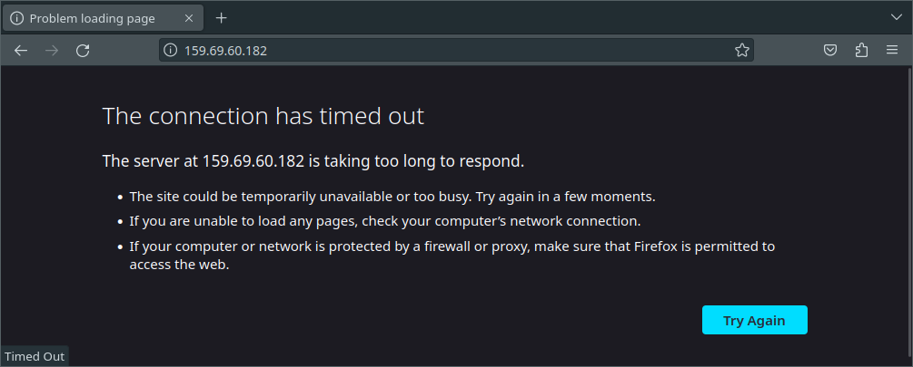
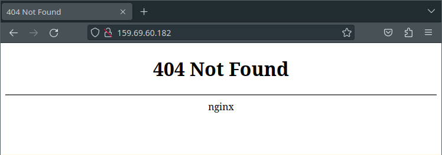
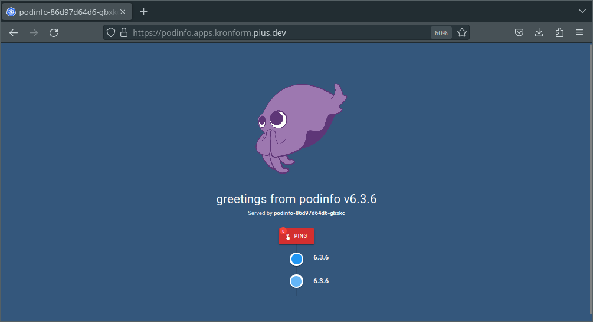

+++
title = "Bare-metal Kubernetes, Part IV: Ingress, DNS, and Certificates"
date = 2023-06-25
draft = false
[taxonomies]
tags = ["kubernetes", "talos", "ingress", "external-dns", "nginx", "cert-manager"]
+++

<i>Discussion on <a href="https://news.ycombinator.com/item?id=37443404">Hacker News</a></i>

Let's reflect on the state of the cluster so far:

* Single node, which is chugging along beauifully.
* Cilium network policies protect our node from the onslaught of the internet.
* Cluster secrets and administrator configs are stored encrypted in git, in case we need them.
* Flux helps to keep our software up to date, and our repository keeps an inventory of what we have deployed.

Our cluster is still relatively useless though, at least for deploying web applications. 

To fix that, we'll need:
1. An [ingress controller](https://kubernetes.github.io/ingress-nginx/), that can take incoming HTTP(S) connections and map them to services running in the cluster.
2. [cert-manager](https://cert-manager.io/), which can retrieve and update certificates for our HTTPS resources.
3. [external-dns](https://github.com/kubernetes-sigs/external-dns), for managing our DNS records, so we don't have to.

*Series Index*
* [Part I: Talos on Hetzner](@/posts/bare-metal-kubernetes-part-1-talos-on-hetzner/index.md)
* [Part II: Cilium CNI & Firewalls](@/posts/bare-metal-kubernetes-part-2-cilium-and-firewalls/index.md)
* [Part III: Encrypted GitOps with FluxCD](@/posts/bare-metal-kubernetes-part-3-encrypted-gitops-with-fluxcd/index.md)
* **[Part IV: Ingress, DNS and Certificates](@/posts/bare-metal-kubernetes-part-4-ingress-dns-certificates/index.md)**
* [Part V: Scaling Out](@/posts/bare-metal-kubernetes-part-5-scaling-out/index.md)
* [Part VI: Persistent Storage with Rook Ceph](@/posts/bare-metal-kubernetes-part-6-persistent-storage-with-rook-ceph/index.md)
* [Part VII: Private Registry with Harbor](@/posts/bare-metal-kubernetes-part-7-private-registry-with-harbor/index.md)
* [Part VIII: Containerizing our Work Environment](@/posts/bare-metal-kubernetes-part-8-containerizing-our-work-environment/index.md)
* [Part IX: Renovating old Deployments](@/posts/bare-metal-kubernetes-part-9-renovating-old-deployments/index.md)
* [Part X: Metrics and Monitoring with OpenObserve](@/posts/bare-metal-kubernetes-part-10-metrics-and-monitoring-with-openobserve/index.md)

Complete source code for the live cluster is available [@github/MathiasPius/kronform](https://github.com/MathiasPius/kronform)

# Ingress Controller
There are many excellent ingress controllers out there supporting a wide range of cases, but since our needs are pretty basic we'll just run with the official Kubernetes [ingress-nginx](https://kubernetes.github.io/ingress-nginx/) controller, not to be confused with the other official [*NGINX* Ingress Controller](https://docs.nginx.com/nginx-ingress-controller/)!

## Considerations
As mentioned in the [guide](https://kubernetes.github.io/ingress-nginx/deploy/baremetal/) there are some special considerations when deploying an(y) ingress controller to a bare-metal cluster.

Ingress controllers usually work by either exposing a `LoadBalancer` service which is picked up by the hosting provider's own controller, which provisions some sort of load balancer externally to the cluster and forwards the traffic to the cluster through a publically accessible `NodePort`, usually in the range `30000-32767`. Alternatively, the load balancer can be configured manually to forward to the exposed port.

Since we don't have a provider, or rather don't want to make use of Hetzner's Load Balancer service, that's not an option for us. We could theoretically still use a `NodePort` service, but telling people to *come visit my awesome site at `https://example.com:31451`* is just not nearly as cool as being able to use the standard http(s) ports and omitting the port.

To achieve this goal, we're gonna have to be bad. But only a little bit.

By running the ingress controller as a daemonset (that is, one instance per node exactly), and allowing it to run in the `hostNetwork: true`, we can let it listen on port `80` and `443` directly on the node, instead of using `NodePort`s. There are some security implications of this, like the ingress controller effectively getting localhost-access to the node, theoretically allowing it to interact with other services running on it. Since we're not running any unauthenticated services directly on the node anyway, and the software we're running is an official piece of Kubernetes software, I judge this risk to be very low.

Another somewhat orthogonal option would be to use a project like [MetalLB](https://metallb.org/) and Hetzner's vSwitch with a floating IP attached, which we could then reassign from node to node if one went down. Advantage of this would be that we could potentially rig the controller in such a way that it only gets access to the virtual VLAN ethernet link attached to the vSwitch, thereby separating it from the "real" node ethernet port. Whether this would actually provide any protection, or is even feasible I'm not sure.

Whatever the case, we won't explore this option for a couple of reasons:
1. Hetzner's vSwitch is limited to 1TB of traffic, with overruns costing extra.
2. Floating IP addresses are pretty expensive.
3. *Allegedly*, traffic running over vSwitch can sometimes perform *worse* than just going through the hair-pinned public addresses of the nodes.
4. All traffic would flow through a single node at all times, instead of being spread out across the nodes.

The last point needs some exposition. By relying solely on DNS for load balancing, we're allowing incoming connections to be spread across all nodes, which is great. In most cases the target service will likely be a one-off, meaning the traffic would have to be routed between the nodes to reach the destination anyway, but this would be the same if using a floating IP. DNS Load Balancing might present a problem if a node goes down however, since even with low TTL and assuming all the intermediate caches respect it, we're probably still looking at upwards of 30 minutes of latency from our controller noticing the node is down and issuing the DNS update, to the time the end user's browser picks up a new address to try.

Enough excuses, let's get to work!

## Deploying the controller with Flux
Just as with Cilium, we'll be using Flux's `HelmRepository` and `HelmRelease` resources to deploy the controller.

I'll allow myself to yada-yada over all the Kustomization shenanigans this time in the interest of brevity, but suffice to say that the procedure is exactly the same as with Cilium.

Create a namespace to hold our ingress controller
```yaml
# manifests/infrastructure/ingress-nginx/namespace.yaml
---
apiVersion: v1
kind: Namespace
metadata:
  name: ingress-nginx
```

And the helm repository and release:
```yaml
# manifests/infrastructure/ingress-nginx/ingress-nginx.yaml
---
apiVersion: source.toolkit.fluxcd.io/v1beta2
kind: HelmRepository
metadata:
  name: ingress-nginx
  namespace: ingress-nginx
spec:
  interval: 5m0s
  url: https://kubernetes.github.io/ingress-nginx

---
apiVersion: helm.toolkit.fluxcd.io/v2beta1
kind: HelmRelease
metadata:
  name: ingress-nginx
  namespace: ingress-nginx
spec:
  interval: 5m
  chart:
    spec:
      chart: ingress-nginx
      version: ">=v4.7.0 <4.8.0"
      sourceRef:
        kind: HelmRepository
        name: ingress-nginx
        namespace: ingress-nginx
      interval: 1m
  values:
    controller:
      hostNetwork: true
      hostPort:
        enabled: true
      kind: DaemonSet
      service:
        enabled: false
```
Note the `hostNetwork` and `hostPort` values which expose the controller on the node itself. I'm also disabling the `service` since we have no use for it, and helm will time out waiting for a load balancer controller to provision it and mark it as ready.

Let's commit it and wait for Flux to do its thing.
```
[mpd@ish]$ kubectl get all -n ingress-nginx 
NAME                                         TYPE        CLUSTER-IP    PORT(S)
service/ingress-nginx-controller-admission   ClusterIP   10.98.32.54   443/TCP

NAME                                      DESIRED   READY   NODE SELECTOR
daemonset.apps/ingress-nginx-controller   1         1       kubernetes.io/os=linux
```


The namespace gets created, as well as the `DaemonSet`, but there's no pod! Let's inspect the daemonset to see what's going on.

Running `kubectl -n ingress-nginx describe daemonset ingress-nginx` reveals a bunch of errors during pod creation:
```bash
Warning  FailedCreate  29s  daemonset-controller
  Error creating: pods "ingress-nginx-controller-zdfff" is forbidden: 
    violates PodSecurity "baseline:latest": 
      host namespaces (hostNetwork=true),
      hostPort (container "controller" uses hostPorts 443, 80, 8443)
```
Oooh, right. Pod Security Policies are finally out and have been replaced with Pod Security Admissions, and in our talos machineconfig, we can see that the apiserver's default enforcement level is set to `baseline:latest`:

```yaml
cluster:
  apiServer:
    disablePodSecurityPolicy: true
    admissionControl:
      - name: PodSecurity
        configuration:
          apiVersion: pod-security.admission.config.k8s.io/v1alpha1
          defaults:
            audit: restricted
            audit-version: latest
            enforce: baseline
            enforce-version: latest
            warn: restricted
            warn-version: latest
```
To be fair, I have been getting a lot of warnings when spawning other pods, but nothing that caused a disruption.

We could of course patch our machineconfig to disable the enforcement, but that seems like a really dumb thing to do. The policy is there to protect us after all, and we *are* doing some really dodgy things!

Instead, let's modify the `ingress-nginx` namespace to be a little more lenient:

```yaml
# manifests/infrastructure/ingress-nginx/namespace.yaml
---
apiVersion: v1
kind: Namespace
metadata:
  name: ingress-nginx
  labels:
    pod-security.kubernetes.io/enforce: privileged
    pod-security.kubernetes.io/enforce-version: latest
```

Commit & Push and wait for the changes to take effect.

```bash
[mpd@ish]$ kubectl get pods -n ingress-nginx     
NAME                             READY   STATUS    RESTARTS   AGE
ingress-nginx-controller-ksxvb   1/1     Running   0          2m36s
```
Gnarly! Let's see if we can get the nginx default page.



A timeout? Oooh, right. The *firewall!*

Let's add some HTTP and HTTPS rules to our `CiliumClusterWideNetworkPolicy` in `manifests/infrastructure/cluster-policies/host-fw-control-plane.yaml`:

```yaml
  # Allow HTTP and HTTPS access from anywhere
  - fromEntities:
    - world
    - cluster
    toPorts:
    - ports:
      - port: "80"
        protocol: "TCP"
      - port: "443"
        protocol: "TCP"
```

You might be wondering why I didn't just create a new `CiliumClusterWideNetworkPolicy` for this express goal to modularize the deployment a bit, and the reason lies in Cilium's enforcement strategy.

As mentioned in Part II, the default Cilium enforcement model does not restrict access unless a policy is actually applied to the endpoint. This means that if we create a separate policy just for HTTP and HTTPS and it somehow gets applied to the node *before* our other policy, then we will immediately lose access to all the important parts of the node like the Talos or Kubernetes API server. We'll of course retain access to he default nginx ingress page, but that's not worth a whole lot.

For this reason, and because there generally aren't that many rules to apply to nodes specifically, I like to keep it all in a single policy.

With that small aside out of the way, our policy will have had a chance to apply, so let's see if we can get a little further.



Great! This is exactly what we expect to see. After all, we haven't defined any ingress routes or anything yet, so the controller has nothing to serve us.

We'll wait with the full-scale test of ingresses till the end of this post. Next up is the root of all sysadmin problems: DNS!

# External DNS
Before we can configure Certificate Manager to fetch certificates for our domains, we'll need to have some way of automatically creating the DNS records. For this, we'll use `external-dns`.

External DNS is a controller which hangs around in you cluster looking for domain name annotations on your services, nodeports and ingresses, and updates your DNS zone to reflect that.

Since we made security allowances in the `ingress-nginx` namespace, we'll put external dns in its own namespace, otherwise it might have been nice to put all the ingress-related controllers in the same namespace.

I'm using Hetzner's DNS service which [was supported by external-dns up to version 0.10.1 (Chart version 1.6.0)](https://github.com/kubernetes-sigs/external-dns/issues/2653) for the domain `pius.dev`

We'll start by creating a token for managing the domain through the [Hetzner DNS Console](https://dns.hetzner.com/settings/api-token). Unfortunately there's no way to limit the token to *.kronform.pius.dev, or even just to the one domain. Luckily, `pius.dev` is the only domain which is managed by Hetzner, so the blast radius is somewhat limited.

With the token in hand, let's put a secret in our kustomization to hold it. We could of course put the token directly in the `env` value of our helm release, but our `.sops.yaml` rules aren't designed to pick up that path. It only encrypts `data` and `stringData`, so either we modify our sops setup (and continue to do so every time we need to encrypt a new field), or we just do the sensible thing and setup a separate secret which we can then point to in the helm release.

```yaml
# manifests/infrastructure/external-dns/hetzner-token.yaml
apiVersion: v1
data:
    HETZNER_TOKEN: <base64-encoded token goes here>
kind: Secret
metadata:
    name: hetzner-token
    namespace: external-dns
type: Opaque
```

Encrypt it in place:
```bash
[mpd@ish]$ sops -e -i manifests/infrastructure/external-dns/hetzner-token.yaml
```

Don't forget to add the `decryption` section to the Kustomization so Flux knows how to decrypt the secret when deploying it. If you don't you'll get a bunch of warnings about unexpected characters at byte 3, when Flux tries to base64-decode `ENC[...`. 

Ask me how I know.

<small>... You already know how I know.</small>


Next, let's configure the helm repository and release. Of note here is the `secretKeyRef` pointing to our `hetzner-token`.
```yaml
# manifests/infrastructure/external-dns/external-dns.yaml
---
apiVersion: source.toolkit.fluxcd.io/v1beta2
kind: HelmRepository
metadata:
  name: external-dns
  namespace: external-dns
spec:
  interval: 5m0s
  url: https://kubernetes-sigs.github.io/external-dns/
---
apiVersion: helm.toolkit.fluxcd.io/v2beta1
kind: HelmRelease
metadata:
  name: external-dns
  namespace: external-dns
spec:
  interval: 5m
  chart:
    spec:
      chart: external-dns
      version: ">=v1.6.0 <1.7.0"
      sourceRef:
        kind: HelmRepository
        name: external-dns
        namespace: external-dns
      interval: 1m
  values:
    provider: hetzner
    domainFilters:
    - kronform.pius.dev
    env:
    - name: HETZNER_TOKEN
      valueFrom:
        secretKeyRef:
          name: hetzner-token
          key: HETZNER_TOKEN
```

```bash
[mpd@ish]$ kubectl logs -n external-dns external-dns-db9868f46-rhdwc
time="2023-06-24T12:35:11Z" level=info msg="Instantiating new Kubernetes client"
time="2023-06-24T12:35:11Z" level=info msg="Using inCluster-config based on serviceaccount-token"
time="2023-06-24T12:35:11Z" level=info msg="Created Kubernetes client https://10.96.0.1:443"
time="2023-06-24T12:35:17Z" level=info msg="All records are already up to date"
```
Looks good.

With two down, there's only one to go: `cert-manager`

# Certificate Manager
`cert-manager` is responsible for monitoring TLS endpoints, ordering certificates through Let's Encrypt (or any ACME-compatible provider), fulfilling the validation process and installing the generated `Certificate` resource in the cluster, for use by our ingress controller.

It's a relatively straight forward deployment and the only helm value we set is `installCRDs`. Now, there's a reason it's disabled by default, and that is that Helm intentionally does not handle CRD upgrades, so as to prevent data loss, however in this case the `Certificate` resources that *might* be lost in a future update of the software will simply be re-issued once the cert-manager catches on, so it's not a huge deal. If we were running a massive cluster with hundreds or thousands of services, such an event might cause us to hit rate-limits with Let's Encrypt, but I don't think that will be relevant in our case.

```yaml
# manifests/infrastructure/cert-manager/cert-manager.yaml
---
apiVersion: source.toolkit.fluxcd.io/v1beta2
kind: HelmRepository
metadata:
  name: jetstack
  namespace: cert-manager
spec:
  interval: 5m0s
  url: https://charts.jetstack.io
---
apiVersion: helm.toolkit.fluxcd.io/v2beta1
kind: HelmRelease
metadata:
  name: cert-manager
  namespace: cert-manager
spec:
  interval: 5m
  chart:
    spec:
      chart: cert-manager
      version: ">=v1.12.0 <1.13.0"
      sourceRef:
        kind: HelmRepository
        name: jetstack
        namespace: cert-manager
      interval: 1m
  values:
    installCRDs: true
```

The one little tricksy thing about cert-manager is that we need to create our own `ClusterIssuer` resources, a custom resource type which `cert-manager` installs. That means there's an explicit dependency between them, which we need to factor into our deployment.

The `ClusterIssuer` resources themselves are pretty simple:

```yaml
# manifests/infrastructure/cluster-issuers/cluster-issuers.yaml
---
apiVersion: cert-manager.io/v1
kind: ClusterIssuer
metadata:
  name: letsencrypt-staging
spec:
  acme:
    server: https://acme-staging-v02.api.letsencrypt.org/directory
    email: contact@pius.io
    privateKeySecretRef:
      name: letsencrypt-staging
    solvers:
    - http01:
        ingress:
          class: nginx
---
apiVersion: cert-manager.io/v1
kind: ClusterIssuer
metadata:
  name: letsencrypt-production
spec:
  acme:
    server: https://acme-v02.api.letsencrypt.org/directory
    email: contact@pius.io
    privateKeySecretRef:
      name: letsencrypt-production
    solvers:
    - http01:
        ingress:
          class: nginx
```
<small>Please don't forget to change the email if you're copy-pasting</small>

Like with Cilium & cluster-policies, I'll be creating an independent Kustomization for the cluster, whose sole purpose is installing these cluster issuers, and then creating a health check for `cert-manager`'s `HelmRelease`:

```yaml
---
apiVersion: kustomize.toolkit.fluxcd.io/v1
kind: Kustomization
metadata:
  name: cluster-issuers
  namespace: flux-system
spec:
  interval: 10m0s
  path: ./manifests/infrastructure/cluster-issuers
  prune: true
  sourceRef:
    kind: GitRepository
    name: flux-system
  healthChecks:
    - apiVersion: helm.toolkit.fluxcd.io/v2beta1
      kind: HelmRelease
      name: cert-manager
      namespace: cert-manager

```

And with that done, we're all set!

# All the things working together

Let's revisit [podinfo](https://github.com/stefanprodan/podinfo), but this time with the full weight of our three musketeers to set up a dns record, retrieve a certificate and forward the traffic.

We're manually deploying this instead of committing it to git, since it's only temporary:
```yaml
---
apiVersion: source.toolkit.fluxcd.io/v1beta2
kind: HelmRepository
metadata:
  name: podinfo
  namespace: default
spec:
  interval: 5m0s
  url: https://stefanprodan.github.io/podinfo
---
apiVersion: helm.toolkit.fluxcd.io/v2beta1
kind: HelmRelease
metadata:
  name: podinfo
  namespace: default
spec:
  interval: 5m
  chart:
    spec:
      chart: podinfo
      version: "=6.3.6"
      sourceRef:
        kind: HelmRepository
        name: podinfo
        namespace: default
      interval: 1m
  values:
    ingress:
      enabled: true
      className: nginx
      annotations:
        cert-manager.io/cluster-issuer: letsencrypt-production
        external-dns.alpha.kubernetes.io/hostname: podinfo.apps.kronform.pius.dev
      hosts:
      - host: podinfo.apps.kronform.pius.dev
        paths:
        - path: /
          pathType: Prefix
      tls:
      - hosts:
        - podinfo.apps.kronform.pius.dev
        secretName: podinfo-tls-secret
```
Of special note are the annotations on the `ingress` values in our `HelmRelease`, which ensure that cert manager and external-dns notice the ingress and do their jobs.

Sure enough, navigating to `https://podinfo.apps.kronform.pius.dev/` gives us back our lovely.. Squid or whatever!



Our cluster is starting to become really damn cool! Only it's not really a *cluster* per se. It's just a single node vibing by itself in some datacenter in Germany.

In Part V we'll commission some more hardware from Hetzner and see if we can get them speaking the same language.