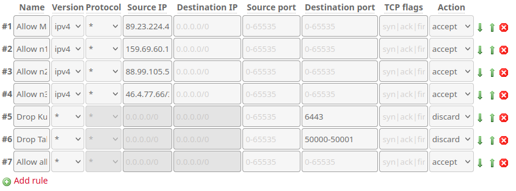
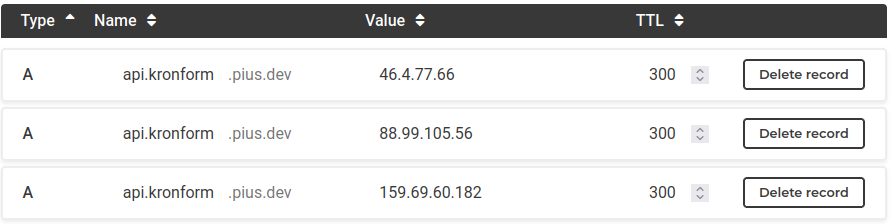

+++
title = "Bare-metal Kubernetes, Part V: Scaling Out"
date = 2023-06-26
draft = false
[taxonomies]
tags = ["kubernetes", "talos", "ingress", "external-dns", "nginx", "cert-manager"]
+++

It's time to get serious about this whole *clustering* thing, so let's add some nodes!

*Series Index*
* [Part I: Talos on Hetzner](@/posts/bare-metal-kubernetes-part-1-talos-on-hetzner/index.md)
* [Part II: Cilium CNI & Firewalls](@/posts/bare-metal-kubernetes-part-2-cilium-and-firewalls/index.md)
* [Part III: Encrypted GitOps with FluxCD](@/posts/bare-metal-kubernetes-part-3-encrypted-gitops-with-fluxcd/index.md)
* [Part IV: Ingress, DNS and Certificates](@/posts/bare-metal-kubernetes-part-4-ingress-dns-certificates/index.md)
* **[Part V: Scaling Out](@/posts/bare-metal-kubernetes-part-5-scaling-out/index.md)**
* Part VI: Persistent Storage with Rook Ceph
* Part VII: Private Registry with Harbor
* Part VIII: Self-hosted Authentication with Kanidm
* Part IX: Monitoring with Prometheus and Grafana
* Part X: Log collection

Complete source code for the live cluster is available [@github/MathiasPius/kronform](https://github.com/MathiasPius/kronform)

# Rethinking Machine Configs
In [Part I: Talos on Hetzner](@/posts/bare-metal-kubernetes-part-1-talos-on-hetzner/index.md) I spent a while defining patches to apply both for nodes and across the whole cluster.

After thinking about what I'm actually trying to achieve with these configs, I realized that defining them declaratively in git and then applying them doesn't make a lot of sense - except when bootstrapping.

`talosctl` has great utilities for upgrading Kubernetes, but this will naturally override the machineconfig of upgraded machines, causing drift. If we treat the git version of the machineconfig as the source of truth, this drift means we might accidentally rollback a Kubernetes version if we naïvely apply an old machineconfig, for example.

For this reason, I think it makes a lot more sense to consider machineconfigs as living documents that can change, and instead keep the git versions for reference and disaster recovery.

For backup and scaling out, I'll get talos to spit out the config for our one node `n1`:
```bash
[mpd@ish]$ mkdir machineconfigs
[mpd@ish]$ talosctl -n n1 get machineconfig -o yaml | yq -y -S '.spec' - > machineconfigs/n1.yaml
```
This command retrieves the actual configuration from the node right now and feeds it through `yq` to make sure filter out comments so we can diff it later.

We'll override the node-specific values with the ones we want for our second `n2` node using a patch[^1].

```yaml
# temp-n2-patch.yaml
- op: replace
  path: /machine/network/hostname
  value: n2
```
<small>JSON Patching is a little overkill for this use case of course, but you might want to also change the `diskSelector`.</small>

We'll apply the patch to our just-fetched `n1.yaml` config and pipe the output through `yq` before writing it to our new `n2.yaml` machineconfig
```bash
[mpd@ish]$ talosctl machineconfig patch \
    --patch @temp-n2-patch.yaml         \
    machineconfigs/n1.yaml | yq -y -S . > machineconfigs/n2.yaml
```

Our machine configs contain sensitive information, and have to be encrypted, so let's add a new section to `.sops.yaml` which match our `secrets.yaml` encryption scheme:

```
- path_regex: machineconfigs/.*.yaml
    encrypted_regex: ^(secret|bootstraptoken|secretboxEncryptionSecret|token|key)$
    pgp: >-
      7668061D49BB2B7BA19118B4031734BEBE51F818
```
**Beware!** Although machineconfigs contain similar sensitive data to `secrets.yaml` at least one field is capitalized differently: `secretboxEncryptionSecret`. If we just reused the `encrypted_regex` from our `secrets.yaml` entry, the machineconfigs' `secretboxEncryptionSecret` would not have been encrypted. This is why you should *always* check any committed file which might contain secrets, even if you think you've already encrypted it. This is one of the risks with using in-repository secret-keeping.

Since we won't need it right now anyway, let's go ahead and encrypt `n1.yaml` immediately:
```bash
[mpd@ish]$ sops -e -i machineconfigs/n1.yaml
```

We now have the config for our second node, but of course nowhere to put it. Let's setup the new server.

# Installing Talos on a Dedicated Server, again.
This installation procedure is exactly the same as in [Part I](https://datavirke.dk/posts/bare-metal-kubernetes-part-1-talos-on-hetzner/#installing-talos-on-a-dedicated-server). Boot into rescue mode, download talos, write it to our intended disk, then reboot.

Waiting a bit for the node to come up, we use the `talosctl disks` command to see if we did it right:
```bash
[mpd@ish]$ talosctl -n 88.99.105.56 disks --insecure
DEV        MODEL              TYPE  MODALIAS      NAME   SIZE     BUS_PATH       SYSTEM_DISK
/dev/sda   SAMSUNG MZ7LM480   SSD   scsi:t-0x00   -      480 GB   .../1:0:0:0/   *
/dev/sdb   ST4000NM0024-1HT   HDD   scsi:t-0x00   -      4.0 TB   .../2:0:0:0/   
/dev/sdc   ST4000NM0024-1HT   HDD   scsi:t-0x00   -      4.0 TB   .../3:0:0:0/
```

Looks like we're all set!

Since we already did the configuration bit, *and* have bootstrapped the cluster, the only thing left to do is to apply the config. Theoretically, talos should take care of the rest for us.
```bash
[mpd@ish]$ talosctl                 \
    --nodes 88.99.105.56            \
    apply-config                    \
    --file machineconfigs/n2.yaml   \
    --insecure
```

# Connectivity
Well.. If we had anticipated this when setting up the Hetzner Firewall of course. `n2` needs access to talos and Kubernetes on `n1` in order to join our cluster and vice-versa, so let's modify our controller template to allow all traffic between our nodes, and then re-apply it:



.. Except it's still not working! The dashboard on our new `n2` is just repeating the same messages ad nauseum, and `n1` has no knowledge of what's going on at all!

```bash
user: warning: [2023-06-26T14:08:13.703605886Z]: [talos] task startAllServices (1/1): service "etcd" to be "up"
user: warning: [2023-06-26T14:08:28.416950886Z]: [talos] controller failed {"component": "controller-runtime", "controller": "k8s.KubeletStaticPodController", "error": "error refreshing pod status: error fetching pod status: an error on the server (\x5c"Authorization error (user=apiserver-kubelet-client, verb=get, resource=nodes, subresource=proxy)\x5c") has prevented the request from succeeding"}
user: warning: [2023-06-26T14:08:28.704688886Z]: [talos] task startAllServices (1/1): service "etcd" to be "up"
user: warning: [2023-06-26T14:08:37.055525886Z]: [talos] etcd is waiting to join the cluster, if this node is the first node in the cluster, please run `talosctl bootstrap` against one of the following IPs:
user: warning: [2023-06-26T14:08:37.056472886Z]: [talos] [88.99.105.56]
 ```

With the Hetzner Firewall out of the way (which was still a necessary step), the problem must be elsewhere.

If `etcd` is waiting to join the cluster, there must be something preventing it from doing os. Checking the service status and logs doesn't reveal anything, so I'm starting to suspect our node-policy might be a little too strict.
```yaml
  # Allow access to etcd and api from other nodes.
  - fromEntities:
    - remote-node
    toPorts:
    - ports:
      - port: "2379"
        protocol: "TCP"
      - port: "2380"
        protocol: "TCP"
```
The node should be perfectly capable of reaching `etcd` on `n1`, *except* `n2` is not a `remote-node` *yet*. It hasn't joined!

Let's remedy this by adding a special policy which allows `etcd` traffic between our servers. The policy will only be relevant before the node is joined, after which the above rule will cover it just fine:
```yaml
  # Allow access to etcd and api from unconfigured nodes
  - fromCIDR:
    - 159.69.60.182/32
    - 88.99.105.56/32
    - 46.4.77.66/32
    toPorts:
    - ports:
      - port: "2379"
        protocol: "TCP"
      - port: "2380"
        protocol: "TCP"
```
*Et voilà!*
```bash
[mpd@ish]$ kubectl get nodes
NAME   STATUS   ROLES           AGE    VERSION
n1     Ready    control-plane   3d6h   v1.27.2
n2     Ready    control-plane   15m    v1.27.2
```
Who said setting up a bare-metal Kubernetes cluster was hard?

Repeating the procedure for the last server makes three:
```bash
[mpd@ish]$ kubectl get nodes
NAME   STATUS   ROLES           AGE    VERSION
n1     Ready    control-plane   3d7h   v1.27.2
n2     Ready    control-plane   27m    v1.27.2
n3     Ready    control-plane   65s    v1.27.2
```

# Finishing up
With all the nodes up and running, we have some minor janitorial duties to perform.

First, we should add our new Talos endpoints to our `talosconfig`:
```yaml
contexts:
  kronform:
    endpoints:
    - 159.69.60.182
    - 88.99.105.56
    - 46.4.77.66
```
Next, we should add the new nodes to our Kubernetes API endpoint DNS record:


Finally, make sure all the machineconfigs are encrypted and push them to git. That way we'll have them.

In **Part VI: Persistent Storage with Rook Ceph** I'll install [Rook](https://rook.io/), which will act as a replication layer on top of our non-talos hard drives and provide replicated [Persistent Volumes](https://kubernetes.io/docs/concepts/storage/persistent-volumes/) which won't disappear if a node dies.

# Epilogue
The fact that this is the shortest post of the whole series so far tells me Talos was probably the right choice.

[^1]: I'm using RFC6902 JSON Patches this sime, since I hit some merge error when trying to use the same style patch as when creating the `n1` config originally.