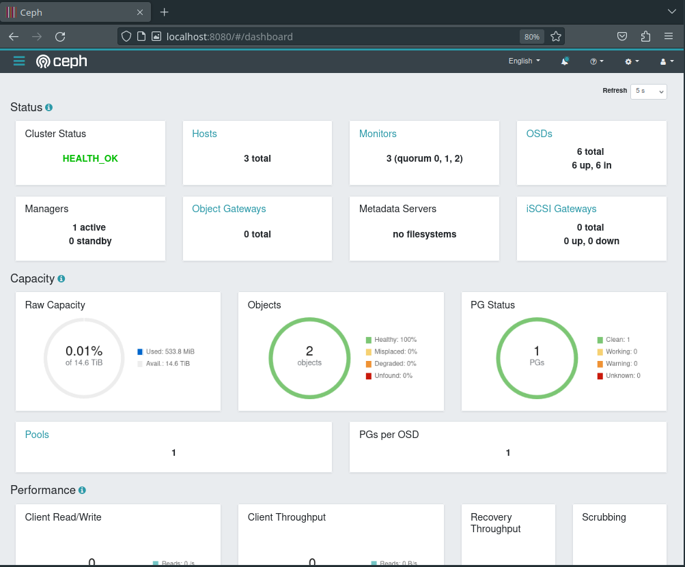
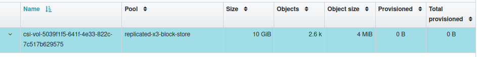

+++
title = "Bare-metal Kubernetes, Part VI: Persistent Storage with Rook Ceph"
date = 2023-06-27
draft = false
[taxonomies]
tags = ["kubernetes", "hetzner", "talos", "ceph", "rook", "storage"]
+++

<i>Discussion on <a href="https://news.ycombinator.com/item?id=37443404">Hacker News</a></i>

If you've been following this series closely you might have seen the two extra hard drives with sizes ranging from 2-4TB on each of the provisioned nodes, totalling 6 disks and 16TB of capacity.

All that capacity is great, but it'd be even better if we could trade some of it for a few guarantees that it won't be gone temporarily when we upgrade a node, or forever the second one of our disks or nodes die.

[Ceph](https://ceph.com/en/) is a distributed storage system which takes raw *[JBODs](https://en.wikipedia.org/wiki/Non-RAID_drive_architectures)* and turns it into resilient networked storage.

[Rook](https://rook.io/) takes Ceph and wraps it in a neat little Kubernetes-friendly package, with a bow and everything!

In this post, I'll be deploying the Rook operators into our cluster and configuring a `CephCluster` as well as a block storage `CephBlockPool` which we can then use to fulfill `PersistentVolumeClaims` in our deployments.

*Series Index*
* [Part I: Talos on Hetzner](@/posts/bare-metal-kubernetes-part-1-talos-on-hetzner/index.md)
* [Part II: Cilium CNI & Firewalls](@/posts/bare-metal-kubernetes-part-2-cilium-and-firewalls/index.md)
* [Part III: Encrypted GitOps with FluxCD](@/posts/bare-metal-kubernetes-part-3-encrypted-gitops-with-fluxcd/index.md)
* [Part IV: Ingress, DNS and Certificates](@/posts/bare-metal-kubernetes-part-4-ingress-dns-certificates/index.md)
* [Part V: Scaling Out](@/posts/bare-metal-kubernetes-part-5-scaling-out/index.md)
* **[Part VI: Persistent Storage with Rook Ceph](@/posts/bare-metal-kubernetes-part-6-persistent-storage-with-rook-ceph/index.md)**
* [Part VII: Private Registry with Harbor](@/posts/bare-metal-kubernetes-part-7-private-registry-with-harbor/index.md)
* [Part VIII: Containerizing our Work Environment](@/posts/bare-metal-kubernetes-part-8-containerizing-our-work-environment/index.md)
* [Part IX: Renovating old Deployments](@/posts/bare-metal-kubernetes-part-9-renovating-old-deployments/index.md)

Complete source code for the live cluster is available [@github/MathiasPius/kronform](https://github.com/MathiasPius/kronform)

# Considerations
Ceph is designed to host truly massive amounts of data, and generally becomes safer and more performant the more nodes and disks you have to spread your data across. While 3 nodes and 6 disks is a decent size for a hobby cluster, it barely registers in the world of Ceph. That being said, I've had Rook/Ceph running in a cluster of this size before and never experienced any problems, even though I broke several guidelines and fucked up the dreaded *placement group* count.

Trying to understand failures in a system as complex and *different* as Ceph is to a regular filesystem can be pretty daunting, and I wouldn't advise anyone to jump into the deep end if their livelihood depends on it. There are several much simpler solutions to this problem, especially if you're willing to go the managed route.

That being said, my experience with Ceph has been really good, and for my use case I have a strong enough grasp of it to *probably* not experience data loss, and that's good enough for me.

# Setting up
Rook provides a handy [helm chart](https://github.com/rook/rook/blob/release-1.11/Documentation/Helm-Charts/operator-chart.md) for deploying their operator with roughly a milion knobs for supporting all kinds of configurations, including accessing an external Ceph cluster. Most of these are not super important, and can be adjusted later when you find out you need to expose your storage as an [NFS](https://rook.io/docs/nfs/v1.7/) server, or what have you.

First we need a namespace to put our cluster and operator in. Since Ceph necessarily needs access to the host devices, we need to relax the security a bit, like we did with the ingress controller:
```yaml
# manifests/infrastructure/rook-ceph/namespace.yaml
---
apiVersion: v1
kind: Namespace
metadata:
  name: rook-ceph
  labels:
    pod-security.kubernetes.io/enforce: privileged
    pod-security.kubernetes.io/enforce-version: latest
```
Next up is the rook operator deployment:
```yaml
# manifests/infrastructure/rook-ceph/rook-ceph.yaml
---
apiVersion: source.toolkit.fluxcd.io/v1beta2
kind: HelmRepository
metadata:
  name: rook-release
  namespace: rook-ceph
spec:
  interval: 5m0s
  url: https://charts.rook.io/release
---
apiVersion: helm.toolkit.fluxcd.io/v2beta1
kind: HelmRelease
metadata:
  name: rook-ceph
  namespace: rook-ceph
spec:
  interval: 5m
  chart:
    spec:
      chart: rook-ceph
      version: ">=v1.11.0 <v1.12.0"
      sourceRef:
        kind: HelmRepository
        name: rook-release
        namespace: rook-ceph
      interval: 1m
  values:
    crds:
      enabled: true
    enableDiscoveryDaemon: true
```

This chart only deploys the *operator* however, and does not in fact turn your cluster into a Ceph cluster. For that, we need to first define a `CephCluster` custom resource.

## The Ceph Cluster
Defining the cluster is also relatively straightforward. Rook has a lot of example configurations both on [their website](https://www.rook.io/docs/rook/latest/CRDs/Cluster/ceph-cluster-crd/) and in their git repository which explain most of the configuration options, like how many *mons* you want. Of course you might have to check out the official [Ceph documentation](https://docs.ceph.com/en/quincy/glossary/#term-Ceph-Monitor) to find out what a *mon* even is.

I'll be using Rook's [Host Storage Cluster](https://rook.io/docs/rook/v1.11/CRDs/Cluster/host-cluster/) example as a template, since it is designed to work on hosts with raw devices, rather than it itself consuming `PersistentVolumes` from a different storage solution, such as managed EBS volumes or whatever one might have access to if they go with a large provider.

```yaml
# manifests/infrastructure/ceph-cluster/cluster.yaml
apiVersion: ceph.rook.io/v1
kind: CephCluster
metadata:
  name: rook-ceph
  namespace: rook-ceph
spec:
  cephVersion:
    image: quay.io/ceph/ceph:v17.2.6
  dataDirHostPath: /var/lib/rook
  mon:
    count: 3
    allowMultiplePerNode: false
  dashboard:
    enabled: true
  storage:
    useAllNodes: true
    useAllDevices: true
  placement:
    all:
      tolerations:
      - effect: NoSchedule
        key: node-role.kubernetes.io/control-plane
        operator: Exists
```
Monitors (or mons) are to Ceph as etcd is to Kubernetes. They're the arbiters of truth within the cluster. By opting to go with 3 of them spread across our nodes (again, like etcd), we can ensure some level of continued operation in the face of a temporary outage.

Dashboard gives us a handy overview over the critical pieces of the Ceph cluster and allows some configuration of our Object Storage Daemons (OSDs).

For storage, we're electing to use all nodes and all attached devices. Of course Rook isn't Chaotic Evil, so it won't start formatting our Talos devices, but it will consume any non-provisioned devices attached, which should be all 6 of the 2TB+ hard drives.

Since all our nodes are control-planes, we need to tell Rook to tolerate that.

With all these things set, we can push it to git and wait for Flux to roll it out.

## Eventual Consistency
Watching Rook slowly mold itself into a Ceph cluster through `kubectl get all -n rook-ceph` is a real pleasure

.. When it works!

Unfortunately, for some reason Ceph refused to take ownership of the HDDs on two of the nodes, resigning itself to deploying a grand total of two OSDs on `n3`. Not very redundant.

Poring through the logs of of the `rook-ceph-osd-prepare-nX` pods showed that the devices were disqualified because they *were too small*. 
```bash
2023-06-27 00:14:14.743354 D | exec: Running command: ceph-volume inventory --format json /dev/sdb
2023-06-27 00:14:15.004877 I | cephosd: skipping device "sdb": ["Insufficient space (<5GB)"].
```
I did say our cluster was a little on the small end of the spectrum, but our hard drives are definitely larger than 5GB. What's going on here?

My first thought was that perhaps some empty or corrupt partition table might be messing with the procedure. After all, it worked on one of the nodes so our settings are probably fine. I used the below script to get access on each of the two failing nodes, modifying the node-selector as I went along:

```bash
[mpd@ish]$ kubectl run -it --rm \
    -n rook-ceph                \
    --image ubuntu:latest       \
    --privileged                \
    --overrides='{"spec": { "nodeSelector": {"kubernetes.io/hostname": "n2"}}}' \
```
And then used `sgdisk` to ensure all remnants of a filesystem were gone on the non-talos hard drives:
```bash
[mpd@ish]$ apt update && apt install gdisk -y
[mpd@ish]$ sgdisk --zap-all /dev/sdb
[mpd@ish]$ sgdisk --zap-all /dev/sdc
```

Killing the `rook-ceph-operator` pod to trigger a re-evaluation, produced the exact same outcome as before. Insufficient space.

A little googling reveals that this is actually because of a [bug](https://github.com/rook/rook/issues/11474) seemingly introduced in Ceph `17.2.4`, which classifies hot-swappable drives as `removable` (which Ceph does not support) and simultaneously bungles the error handling in a way that makes this particular error show up as *Insufficient space (<5GB)*. As of Ceph `17.2.6`, which is the version we're on, this bug is still present.

For now we'll work around the issue by rolling back to `17.2.3`. This is not ideal, and is in fact not *really* possible. Performing this rollback by just changing `cephVersion.image` in the above manifest made rook carefully remove a Monitor instance and replace it with the older version, only to have it crash loop, presumably because that kind of operation is not supported.

In the end, I opted to delete the `CephCluster`, following the official [cleanup procedure](https://rook.io/docs/rook/latest/CRDs/Cluster/ceph-cluster-crd/#cleanup-policy) and re-deploying it after rook-operator had a chance to clean up.

## Dashboard
This time around the `rook-ceph` namespace is littered with `osd` pods:
```bash
[mpd@ish]$ kubectl get pods -n rook-ceph | grep osd
rook-ceph-osd-0-5dddbd6b66-x294g    1/1     Running
rook-ceph-osd-1-dc8bb7f6b-dmljl     1/1     Running
rook-ceph-osd-2-8449684665-p22jp    1/1     Running
rook-ceph-osd-3-c695bc8dd-2lhmh     1/1     Running
rook-ceph-osd-4-6f99d7bc47-qxvgv    1/1     Running
rook-ceph-osd-5-755689595-m98rt     1/1     Running
rook-ceph-osd-prepare-n1-dp4wg      0/1     Completed
rook-ceph-osd-prepare-n2-shb4d      0/1     Completed
rook-ceph-osd-prepare-n3-bl2vv      0/1     Completed
```
Apart from the `prepare` nodes, each of these containers correspond to a single hard drive managed by Ceph. To get a better view of the state of things, and to verify that everything is looking healthy, let's take a quick look at the Ceph Dashboard.

First, we need to get the automatically generated dashboard admin password, which is stored in the `rook-ceph-dashboard-password` secret of the `rook-ceph` namespace:

```bash
[mpd@ish]$ kubectl get secret     \
  -n rook-ceph                    \
  -o jsonpath='{.data.password}'  \
  rook-ceph-dashboard-password    \
  | base64 -d | clipcopy
```
I'm grabbing the `data.password` field, base64 decoding it and shoving it directly into my clipboard.

Now we could set up an ingress with automatic dns and all the bells and whistles and have access to it from anywhere, but until we know that we can stay up to date on security patches, it might be best to just port-forward the dashboard service to our local machines for now, and have a quick peek.

```bash
[mpd@ish]$ kubectl port-forward -n rook-ceph svc/rook-ceph-mgr-dashboard 8080:7000
Forwarding from 127.0.0.1:8080 -> 7000
Forwarding from [::1]:8080 -> 7000
```
This lets us connect to the service inside Kubernetes from `localhost:8080` and log in as `admin` with the password from before, and what we see looks great!



# Pools and Storage Classes
With Ceph working, we just have to tell it how to divide up the available storage into pools. We do this by defining a `CephBlockPool`:
```yaml
apiVersion: ceph.rook.io/v1
kind: CephBlockPool
metadata:
  name: replicated-x3-block-store
  namespace: rook-ceph
spec:
  failureDomain: host
  replicated:
    size: 3
```
Easy peasy. Our `replicated-x3-block-store` with `failureDomain: host` and `replicated.size: 3` will make sure that data is triplicated to all three of our hosts, meaning we can lose any two hosts without experiencing data loss. Of course this also reduces our available capacity from 14.6TB to just ~4TB. Luckily Ceph is pretty flexible, so if we start running into space issues, we can scale up our cluster, create an erasure-coded pool (at the expense of some cpu and memory) or scale down to 2x replication. This pool will only be used for workloads where we really don't want to lose data.

With the pool created, we just need to expose it to Kubernetes through a [StorageClass](https://kubernetes.io/docs/concepts/storage/storage-classes/) based on Rook's [own example](https://rook.io/docs/rook/v1.11/Storage-Configuration/Block-Storage-RBD/block-storage/#provision-storage)
```yaml
---
apiVersion: storage.k8s.io/v1
kind: StorageClass
metadata:
  name: replicated-x3-block-store
  annotations:
    storageclass.kubernetes.io/is-default-class: "true"
provisioner: rook-ceph.rbd.csi.ceph.com
reclaimPolicy: Retain
allowVolumeExpansion: true
parameters:
  # clusterID is the namespace where the rook cluster is running
  clusterID: rook-ceph
  # Ceph pool into which the RBD image shall be created
  pool: replicated-x3-block-store

  imageFormat: "2"
  # For more information about these features see:
  # https://docs.ceph.com/en/latest/rbd/rbd-config-ref/#image-features
  # tl;dr: They're available from Linux kernel 5.14
  # and improves performance.
  imageFeatures: layering,fast-diff,object-map,deep-flatten,exclusive-lock

  # The secrets contain Ceph admin credentials.
  csi.storage.k8s.io/provisioner-secret-name: rook-csi-rbd-provisioner
  csi.storage.k8s.io/provisioner-secret-namespace: rook-ceph
  csi.storage.k8s.io/controller-expand-secret-name: rook-csi-rbd-provisioner
  csi.storage.k8s.io/controller-expand-secret-namespace: rook-ceph
  csi.storage.k8s.io/node-stage-secret-name: rook-csi-rbd-node
  csi.storage.k8s.io/node-stage-secret-namespace: rook-ceph
  csi.storage.k8s.io/fstype: ext4
```
Out of an abundance of caution, we set the `reclaimPolicy` to `Retain`, which means we'll have to manually prune `PersistentVolumes` to claw back space, but it also means we won't lose data if we accidentally delete a volume claim.

# Conclusion
To test if it worked, we can create a persistent volume claim:
```yaml
apiVersion: v1
kind: PersistentVolumeClaim
metadata:
  name: test-pvc
spec:
  accessModes:
  - ReadWriteOnce
  resources:
    requests:
      storage: 10Gi
  storageClassName: replicated-x3-block-store
```
And very soon after an allocated block "image" appears in the Ceph dashboard:



The relation between these two is not immediately obvious, except for the size, but chasing down the imageName from the `PersistentVolume` created to satisfy the `PersistentVolumeClaim` shows the relation:
```bash
[mpd@ish]$ kubectl get pvc          \
  -o jsonpath='{.spec.volumeName}'  \
  test-pv
pvc-e1470495-3eee-47ab-881a-c66f45a71f3b

[mpd@ish]$ kubectl get pv                               \
  -o jsonpath='{.spec.csi.volumeAttributes.imageName}'  \
  pvc-e1470495-3eee-47ab-881a-c66f45a71f3b
csi-vol-5039f1f5-641f-4e33-822c-7c517b629575
```
In [Part VII: Private Registry with Harbor](@/posts/bare-metal-kubernetes-part-7-private-registry-with-harbor/index.md) we'll put this persistent storage to use by setting up a private container registry with a pull-through cache.
