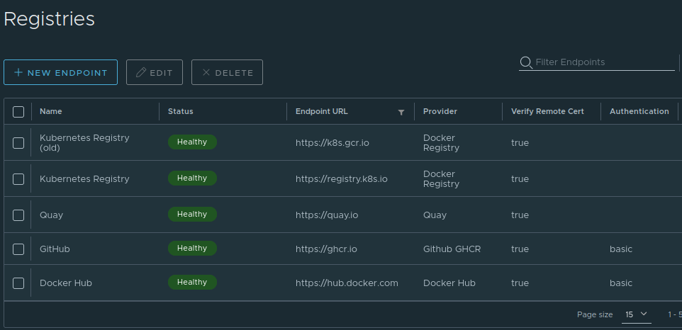
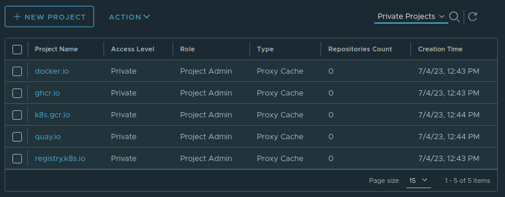
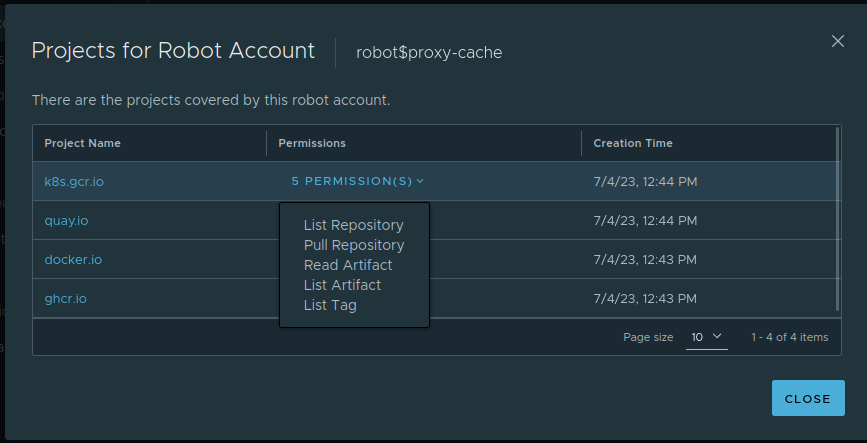
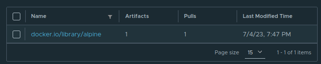

+++
title = "Bare-metal Kubernetes, Part VII: Private Registry with Harbor"
date = 2023-07-06
draft = false
[taxonomies]
tags = ["kubernetes", "hetzner", "harbor", "proxy", "cache", "private registry"]
+++

Keeping track of all your dependencies can be extremely difficult. With modern packaging, distribution, and deployment methods enabling really fast iteration (as evidenced by this series), it's easy to build dependencies on all kinds of external services, without realizing it.

One *type* of dependency we're relying heavily on, is the presence of container registries for all our workloads. Even our [Linux/Kubernetes distribution](https://www.talos.dev/v1.4/reference/configuration/#installconfig) is built on container images! Being able to cache these images locally would be a nice insurance against network issues and registry outages, and for that we'll need a private registry with proxy caching, also known as a pull-through cache.

*Series Index*
* [Part I: Talos on Hetzner](@/posts/bare-metal-kubernetes-part-1-talos-on-hetzner/index.md)
* [Part II: Cilium CNI & Firewalls](@/posts/bare-metal-kubernetes-part-2-cilium-and-firewalls/index.md)
* [Part III: Encrypted GitOps with FluxCD](@/posts/bare-metal-kubernetes-part-3-encrypted-gitops-with-fluxcd/index.md)
* [Part IV: Ingress, DNS and Certificates](@/posts/bare-metal-kubernetes-part-4-ingress-dns-certificates/index.md)
* [Part V: Scaling Out](@/posts/bare-metal-kubernetes-part-5-scaling-out/index.md)
* [Part VI: Persistent Storage with Rook Ceph](@/posts/bare-metal-kubernetes-part-6-persistent-storage-with-rook-ceph/index.md)
* **[Part VII: Private Registry with Harbor](@/posts/bare-metal-kubernetes-part-7-private-registry-with-harbor/index.md)**

Complete source code for the live cluster is available [@github/MathiasPius/kronform](https://github.com/MathiasPius/kronform)

# How bad is it?
Before we go get into the nitty-gritty, let's take a second to see how dependent we actually are.

Using kubectl and some grep magic we can get a complete overview of all the images in use by pods running in our cluster:

```bash
[mpd@ish]$ kubectl get pod -A -o yaml | grep 'image:' | sort -u
image: docker.io/coredns/coredns:1.10.1
image: docker.io/rook/ceph:v1.11.8
image: ghcr.io/fluxcd/helm-controller:v0.34.1
image: ghcr.io/fluxcd/kustomize-controller:v1.0.0-rc.4
image: ghcr.io/fluxcd/notification-controller:v1.0.0-rc.4
image: ghcr.io/fluxcd/source-controller:v1.0.0-rc.5
image: k8s.gcr.io/external-dns/external-dns:v0.10.1
image: quay.io/ceph/ceph:v17.2.3
image: quay.io/cephcsi/cephcsi:v3.8.0
image: quay.io/cilium/cilium:v1.13.4@sha256..
image: quay.io/cilium/hubble-relay:v1.13.4@sha256..
image: quay.io/cilium/hubble-ui-backend:v0.11.0@sha256..
image: quay.io/cilium/hubble-ui:v0.11.0@sha256..
image: quay.io/cilium/operator-generic:v1.13.4@sha256..
image: quay.io/jetstack/cert-manager-cainjector:v1.12.2
image: quay.io/jetstack/cert-manager-controller:v1.12.2
image: quay.io/jetstack/cert-manager-webhook:v1.12.2
image: registry.k8s.io/ingress-nginx/controller:v1.8.0@sha256..
image: registry.k8s.io/kube-apiserver:v1.27.2
image: registry.k8s.io/kube-controller-manager:v1.27.2
image: registry.k8s.io/kube-scheduler:v1.27.2
image: registry.k8s.io/sig-storage/csi-attacher:v4.1.0
image: registry.k8s.io/sig-storage/csi-node-driver-registrar:v2.7.0
image: registry.k8s.io/sig-storage/csi-provisioner:v3.4.0
image: registry.k8s.io/sig-storage/csi-resizer:v1.7.0
image: registry.k8s.io/sig-storage/csi-snapshotter:v6.2.1
image: rook/ceph:v1.11.8
```
<small>sha256 images omitted for brevity</small>

28 different container images, and we haven't even finished laying the ground work yet! Being able to cache at least some of these images locally will help save both ourselves and their courteous hosts a decent amount of bandwidth, and make our setup a little more resilient, and with [Harbor](https://goharbor.io/) we even get a few nice bonuses like vulnerability scanning for free, which later on can help alert us when it's time to upgrade.

# Installing Harbor
Harbor has an official deployment helm chart located [here](https://github.com/goharbor/harbor-helm), but after a few test runs it turns out that the official helm chart is not all that great. It does not drop root-level capabilities, nor pledge to run as non-root, which means it will run afoul of our pod security admissions which by default refuses to run such pods, unless the namespace in which they run has been explicitly granted those permissions.

Looking around a bit, [Bitnami](https://bitnami.com/stack/harbor-registry) seems to have a much more modern packaged helm chart for Harbor deployment than Harbor themselves, so let's use that instead.

To deploy it, we use the same `HelmRepository` & `HelmRelease` combo as we've done so many times before.

Filling in the values for the helm deployment is straight-forward for the most part:

```yaml
externalURL: https://registry.kronform.pius.dev
adminPassword: changeme
persistence:
  persistentVolumeClaim:
    registry:
      size: 50Gi
```
We define a publicly accessible URL, which we'll configure an ingress for in a second, a one-time admin password which we'll change when we log in the first time, and a little bit of Ceph-backed persistent storage for our images, so we can reach them even if only one node is available.

Next up, the ingress.
```yaml
exposureType: ingress
ingress:
  core:
    annotations:
      cert-manager.io/cluster-issuer: letsencrypt-production
      external-dns.alpha.kubernetes.io/hostname: registry.kronform.pius.dev
    hostname: registry.kronform.pius.dev
    tls: true
  notary:
    annotations:
      cert-manager.io/cluster-issuer: letsencrypt-production
      external-dns.alpha.kubernetes.io/hostname: notary.kronform.pius.dev
    hostname: notary.kronform.pius.dev
    tls: true
```
We use the `external-dns` and `cert-manager` annotations and let them handle certificates and TLS for us.

And then.. A little bit of repetitive overrides:
```yaml
core:
  updateStrategy:
    type: Recreate
jobservice:
  updateStrategy:
    type: Recreate
registry:
  updateStrategy:
    type: Recreate
notary:
  server:
    updateStrategy:
      type: Recreate
  signer:
    updateStrategy:
      type: Recreate
```
Since we're using `CephBlockPool`s which only supports the `ReadWriteOnce` access mode to fulfill our `PersistentVolumeClaim`s we can't bind the volume in multiple places at once. This means that if the `ReplicaSet` is attempting to do a rolling upgrade, it will time out waiting for the replacement pod to attach the volume which is already exclusively bound to the pod it is trying to replace!

 We could go back and define a [CephFS](https://rook.io/docs/rook/v1.11/Storage-Configuration/Shared-Filesystem-CephFS/filesystem-storage/) backed `StorageClass` which supports shared access, also called `ReadWriteMany`, but we don't really want multiple registries running at once. CephFS is a great solution to shared persistent storage in a cluster, and we will probably have a great use for it later, but because they have to support actual filesystems instead of just dumb single-access block storage, they're a bit more complex and requires Ceph to stand up metadata servers to keep track of file and directory metadata.

Anyway, with all those values set, it's time to commit and push!

---

Now for some reason the deployment never seemed to conclude successfully from Flux's point of view, even though the registry was reachable. It turns out that while setting up the ingress controller, I missed a small detail: The ingress controller admission hook.

```bash
Internal error occurred: failed calling webhook "validate.nginx.ingress.kubernetes.io": Post https://ingress-nginx-controller-admission.ingress-nginx.svc:443/extensions/v1beta1/ingresses?timeout=30s: context deadline exceeded
```

When deploying [Kubernetes' ingress nginx](@/posts/bare-metal-kubernetes-part-4-ingress-dns-certificates/index.md#deploying-the-controller-with-flux), it also sets up an admission hook that checks the validity of the incoming ingresses, "admitting" ones that are correctly defined. But there's nothing wrong with our Harbor ingress, the problem lies elsewhere.

Having deployed ingress-nginx with `hostNetwork: true`, the admission controller too is exposed on the node itself, which means that our `CiliumClusterWideNetworkPolicy` applies, and since we haven't explicitly allowed access to the admission controller's port `8443` on the node, the traffic is dropped. We can fix this by allowing access to the admission controller port in our policy:

```yaml
# manifests/infrastructure/cluster-policies/host-fw-control-plane.yaml
# ...

  # Allow access from inside the cluster to
  # the admission controller
  - fromEntities:
    - cluster
    toPorts:
    - ports:
      - port: "8443"
        protocol: "TCP"
```

With this policy applied, the `HelmRelease` is finally considered correctly deployed.

Next, let's set up proxy caches for some of the bigger registries.

# Harbor Proxy Caches

Using our list of used images above as a reference, we setup *Registries* for each, setting up users and providing the authentication details where applicable:



Next, we need to define *Projects* which use these *Registries* as their upstream backends.

Essentially we create a Harbor project named `docker.io` hosted at `registry.kronform.pius.dev/docker.io` which opaquely queries the actual registry at *https://docker.io* behind the scenes.

For simplicitly I've named the projects the same as the backing registry, so if we wanted to explicitly use these mirrors we can just prefix it with `registry.kronform.pius.dev/`.

For example, `quay.io/cilium/cilium:v1.13` => `registry.kronform.pius.dev/quay.io/cilium/cilium:v1.13`.

Here's the list of the configured projects:


I initially set projects as public, again to keep it simple, but since Talos supports both overriding image registries and setting authentication for this, I figured it'd be safer to use a robot account and making them private. That way we don't have to deal with someone abusing projects to bypass registry rate-limiting and getting our own users blocked.

The robot account is granted list, get and read permissions on repositories, tags and artifacts:



# Configuring Talos Overrides

With the proxy cache up and running, we will configure one of our Talos machines to use that as a mirror to test it and see if the images get pulled through the cache. We'll also specify the actual endpoints in the mirror list, to act as a fallback in in case Harbor fails or needs an upgrade. It can't hardly pull images through itself!

Because the mirror list is a bit long, we'll be applying a patch to the machineconfig instead of using `talosctl edit machineconfig`, so we get it right for all nodes. It would be a real pain to debug why pods are not getting scheduled *sometimes* because one of our nodes happens to have a bad mirror configuration.

```yaml
# patch.yaml
- op: add
  path: /machine/registries
  value:
    mirrors:
      docker.io:
        endpoints:
          - https://registry.kronform.pius.dev/v2/docker.io
          - https://docker.io/v2
        overridePath: true
      ghcr.io:
        endpoints:
          - https://registry.kronform.pius.dev/v2/ghcr.io
          - https://ghcr.io/v2
        overridePath: true
      gcr.io:
        endpoints:
          - https://registry.kronform.pius.dev/v2/gcr.io
          - https://gcr.io/v2
        overridePath: true
      registry.k8s.io:
        endpoints:
          - https://registry.kronform.pius.dev/v2/registry.k8s.io
          - https://registry.k8s.io/v2
        overridePath: true
    config:
      registry.kronform.pius.dev:
        auth:
          username: robot$proxy-cache
          password: <Robot Account Password>
      docker.io:
        auth:
          username: mathiaspius
          password: <Docker Hub PAT>
      ghcr.io:
        auth:
          username: mathiaspius
          password: <GitHub Pat>
```

We'll use the `talosctl patch` utility to apply the patch on a single node:

```bash
[mpd@ish] talosctl -n 159.69.60.182 patch machineconfig --patch @patch.yaml
```

Now let's test if it worked. We'll pull an image we haven't used before, `alpine:latest`, because it's small, and set the nodeSelector to our `n1` node, which is the one we just patched:

```bash
[mpd@ish]$ kubectl run -it --rm --image alpine:latest \
  --overrides='{"apiVersion": "v1", "spec": {"nodeSelector": { "kubernetes.io/hostname": "n1" }}}' \
  test-pod
/ # exit 
```
If everything worked out, `containerd` should have attempted to pull the image through our Harbor registry first, and we will see a single repository in our `docker.io` project. Sure enough:



We finish up by applying the patch to the two other machines.

Importantly, our `sops` config does not currently cover the `password:` field of our registry config, so we add that before backing up, sops-encrypting and committing them to git.

# Conclusion

To tie a neat little bow on this post, let's just go ahead and pull all of our images through our proxy. Since the images are already available on most of the nodes, we can't just redeploy containers onto them, as it won't trigger another pull. The best way I cold come up with is to pull the images to our local machine through Harbor:

First we gather a comprehensive list of unique images we're using and slap our *https://registry.kronform.pius.dev/* prefix on it, then pull:

```bash
[mpd@ish]$ docker login registry.kronform.pius.dev
Username: robot$proxy-cache
Password: ********
Login Succeeded

[mpd@ish]$ kubectl get pods -A -o yaml                  \
  | rg -o "image: (.*)" -r '$1'                         \
  | grep -v '^sha256'                                   \
  | sort -u                                             \
  | xargs -n1 printf "registry.kronform.pius.dev/%s\n"  \
  | xargs -n1 docker pull
```
<small>Some of the images might assume the default `docker.io` so for any images which fails to pull, we just edit it manually and run it again.</small>

All done!